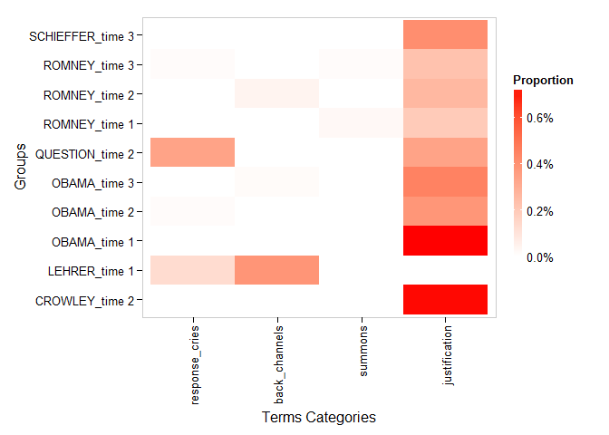
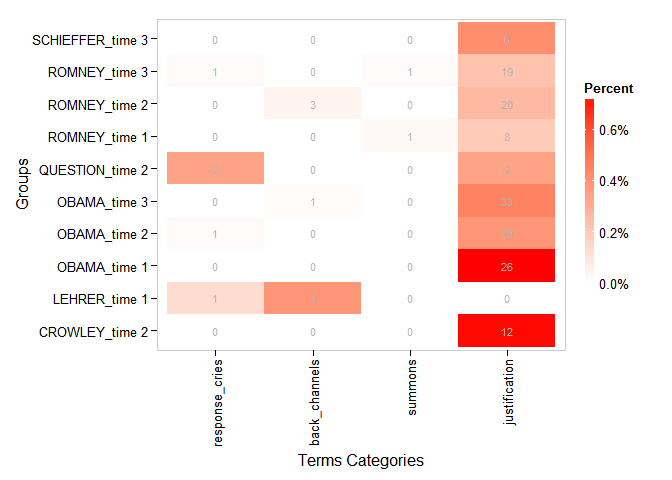
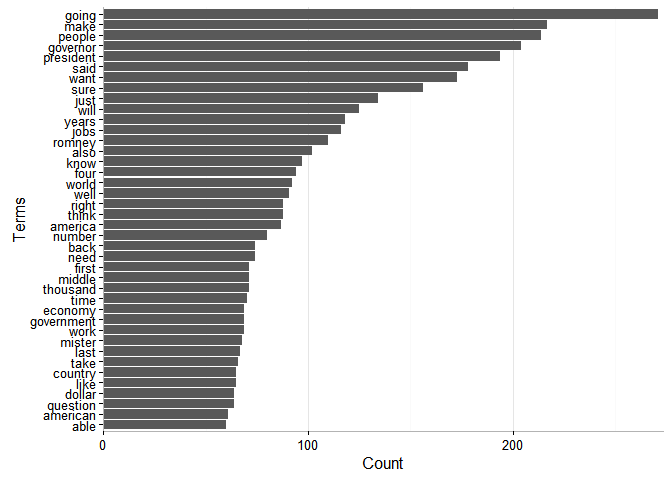
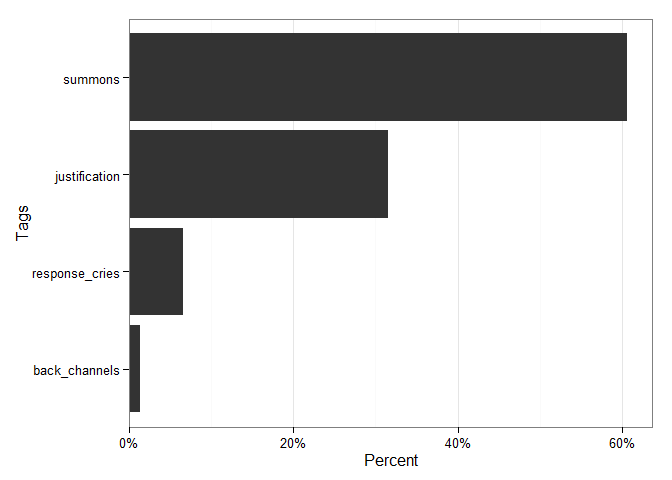

termco
============

**termco** is A small suite of functions used to count and find terms
and substrings in strings. The tools can be used to build a expert
rules, regular expression based text classification model. The package
wraps the
[**data.table**](https://cran.r-project.org/web/packages/data.table/index.html)
and
[**stringi**](https://cran.r-project.org/web/packages/stringi/index.html)
packages to create fast data frame counts of regular expression terms
and substrings.

Table of Contents
============

-   [Installation](#installation)
-   [Contact](#contact)
    -   [Examples](#examples)
        -   [Print Method](#print-method)
        -   [Plot Method](#plot-method)
    -   [Building an Expert Rules, Regex Classifier Model](#building-an-expert-rules-regex-classifier-model)
        -   [Load the Tools/Data](#load-the-toolsdata)
        -   [View Most Used Words](#view-most-used-words)
        -   [Building the Model](#building-the-model)
        -   [Testing the Model](#testing-the-model)
        -   [Improving the Model](#improving-the-model)
        -   [Categorizing/Tagging](#categorizingtagging)
        -   [Accuracy](#accuracy)

Installation
============

To download the development version of **termco**:

Download the [zip
ball](https://github.com/trinker/termco/zipball/master) or [tar
ball](https://github.com/trinker/termco/tarball/master), decompress and
run `R CMD INSTALL` on it, or use the **pacman** package to install the
development version:

    if (!require("pacman")) install.packages("pacman")
    pacman::p_load_gh("trinker/termco")

Contact
=======

You are welcome to: 
* submit suggestions and bug-reports at: <https://github.com/trinker/termco/issues> 
* send a pull request on: <https://github.com/trinker/termco/> 
* compose a friendly e-mail to: <tyler.rinker@gmail.com>

Examples
--------

The following examples demonstrate some of the functionality of
**termco**.

    library(termco); library(qdapRegex)

    data(pres_debates2012)

    discoure_markers <- list(
        response_cries = c("oh", "ah", "aha", "ouch", "yuk"),
        back_channels = c("uh[- ]huh", "uhuh", "yeah"),
        summons = "hey",
        justification = "because"
    )

    with(pres_debates2012, term_count(dialogue, list(person, time), discoure_markers))

    ## Coverage: 100% 
    ## Source: local data frame [10 x 7]
    ## 
    ##       person   time n.words response_cries back_channels   summons
    ##       (fctr) (fctr)   (int)          (chr)         (chr)     (chr)
    ## 1      OBAMA time 1    3599        4(.11%)             0 43(1.19%)
    ## 2      OBAMA time 2    7477        2(.03%)             0  42(.56%)
    ## 3      OBAMA time 3    7243        4(.06%)       1(.01%)  58(.80%)
    ## 4     ROMNEY time 1    4085        1(.02%)             0  27(.66%)
    ## 5     ROMNEY time 2    7536        6(.08%)       3(.04%)  49(.65%)
    ## 6     ROMNEY time 3    8303        8(.10%)             0 84(1.01%)
    ## 7    CROWLEY time 2    1672        2(.12%)             0   4(.24%)
    ## 8     LEHRER time 1     765        6(.78%)       3(.39%)         0
    ## 9   QUESTION time 2     583        2(.34%)             0         0
    ## 10 SCHIEFFER time 3    1445              0             0   2(.14%)
    ## Variables not shown: justification (chr)

### Print Method

    print(markers, pretty = FALSE)

    ## Coverage: 100% 
    ## Source: local data frame [10 x 8]
    ## 
    ##       person   time n.words  like water justify    he    we
    ##       (fctr) (fctr)   (int) (int) (int)   (int) (int) (int)
    ## 1      OBAMA time 1    3599     5     0      26    43   120
    ## 2      OBAMA time 2    7477    16     0      29   109   318
    ## 3      OBAMA time 3    7243    10     1      33    59   451
    ## 4     ROMNEY time 1    4085     9     0       8    34   121
    ## 5     ROMNEY time 2    7536    12     4      20    93   199
    ## 6     ROMNEY time 3    8303    18     0      19    46   447
    ## 7    CROWLEY time 2    1672     3     0      12    38    44
    ## 8     LEHRER time 1     765     1     0       0     9    20
    ## 9   QUESTION time 2     583     0     0       2     4     9
    ## 10 SCHIEFFER time 3    1445     6     0       6    10    52

    print(markers, zero.replace = "_")

    ## Coverage: 100% 
    ## Source: local data frame [10 x 8]
    ## 
    ##       person   time n.words     like   water  justify         he
    ##       (fctr) (fctr)   (int)    (chr)   (chr)    (chr)      (chr)
    ## 1      OBAMA time 1    3599  5(.14%)       _ 26(.72%)  43(1.19%)
    ## 2      OBAMA time 2    7477 16(.21%)       _ 29(.39%) 109(1.46%)
    ## 3      OBAMA time 3    7243 10(.14%) 1(.01%) 33(.46%)   59(.81%)
    ## 4     ROMNEY time 1    4085  9(.22%)       _  8(.20%)   34(.83%)
    ## 5     ROMNEY time 2    7536 12(.16%) 4(.05%) 20(.27%)  93(1.23%)
    ## 6     ROMNEY time 3    8303 18(.22%)       _ 19(.23%)   46(.55%)
    ## 7    CROWLEY time 2    1672  3(.18%)       _ 12(.72%)  38(2.27%)
    ## 8     LEHRER time 1     765  1(.13%)       _        _   9(1.18%)
    ## 9   QUESTION time 2     583        _       _  2(.34%)    4(.69%)
    ## 10 SCHIEFFER time 3    1445  6(.42%)       _  6(.42%)   10(.69%)
    ## Variables not shown: we (chr)

### Plot Method

    plot(markers)

    plot(markers, labels=TRUE)

Building an Expert Rules, Regex Classifier Model
------------------------------------------------

This example section highlights the types of function combinations and
order for a typical expert rules classification. This task typically
involves the combined use of available literature, close examinations of
term usage within text, and researcher experience. Building a classifier
model requires the researcher to build a list of regular expressions
that map to a category or tag. Below I outline minimal work flow for
classification.

### Load the Tools/Data

    library(dplyr); library(ggplot2)
    data(presidential_debates_2012)

### View Most Used Words

A common task in building a model is to understand the most frequent
words while excluding less information rich function words. The
`frequnt_terms` function produces an ordered data frame of counts. The
researcher can exclude stop words and limit to terms to contain n
characters between set thresholds. The output is ordered by most to
least frequent n terms but can be rearranged alphabetically.

    presidential_debates_2012 %>%
        with(., frequent_terms(dialogue))

    ##    term      frequency
    ## 1  going     271      
    ## 2  make      217      
    ## 3  people    214      
    ## 4  governor  204      
    ## 5  president 194      
    ## 6  said      178      
    ## 7  want      173      
    ## 8  sure      156      
    ## 9  just      134      
    ## 10 will      125      
    ## 11 years     118      
    ## 12 jobs      116      
    ## 13 romney    110      
    ## 14 also      102      
    ## 15 know       97      
    ## 16 four       94      
    ## 17 world      92      
    ## 18 well       91      
    ## 19 right      88      
    ## 20 think      88

    presidential_debates_2012 %>%
        with(., frequent_terms(dialogue, 40)) %>%
        plot()

### Building the Model

To build a model the researcher created a named list of regular
expressions that map to a category/tag. This is fed to the `term_count`
function. `term_count` allows for aggregation by grouping variables but
for building the model we usually want to get observation level counts.
Set `grouping.var = TRUE` to generate an `id` column of 1 through number
of observation which gives the researcher the observation level counts.

    discoure_markers <- list(
        response_cries = c("oh", "ah", "aha", "ouch", "yuk"),
        back_channels = c("uh[- ]huh", "uhuh", "yeah"),
        summons = "hey",
        justification = "because"
    )

    model <- presidential_debates_2012 %>%
        with(term_count(dialogue, grouping.var = TRUE, discoure_markers))

    model

    ## Coverage: 13.19% 
    ## Source: local data frame [2,912 x 6]
    ## 
    ##       id n.words response_cries back_channels   summons justification
    ##    (int)   (int)          (chr)         (chr)     (chr)         (chr)
    ## 1      1      10              0             0         0             0
    ## 2      2       9      1(11.11%)             0         0             0
    ## 3      3      14              0             0         0             0
    ## 4      4      14              0             0         0             0
    ## 5      5       5      1(20.00%)             0         0             0
    ## 6      6       5              0             0         0             0
    ## 7      7      40              0             0         0             0
    ## 8      8       2              0             0         0             0
    ## 9      9      20              0             0 2(10.00%)             0
    ## 10    10      13              0             0  1(7.69%)             0
    ## ..   ...     ...            ...           ...       ...           ...

### Testing the Model

In building a classifier the researcher is typically concerned with
coverage, discrimination, and accuracy. The first two are easier to
obtain while accuracy is not possible to compute without a comparison
sample of expertly tagged data.

We want out model to be giving tags to as much of the text elements as
possible. The `coverage` function can provide an understanding of what
percent of the data is tagged. Out model has relatively low coverage,
indicating the regular expression model needs to be improved.

    model %>%
        coverage()

    ## Coverage:    13.19%
    ## Coverered:   384
    ## Not Covered: 2528

Understanding how well out model discriminates is important as well. We
want the model to cover as close to 100% of the data as possible, but
likely want fewer tags assigned to each element. If the model is tagging
many tags to each element is is not able to discriminate well. The
`as_terms` + `plot_freq` function provides a visual representation of
the model's ability to discriminate. The output is a density plot
showing the distribution of the number of tags at the element level. The
goal is to have a larger cluster around one tag. Note that the plot also
gives a view of coverage as the zero bar shows the frequency of elements
that could not be tagged. Our model has a larger distribution of 1 tag
compared to the \> 1 tag distributions, though the coverage is very
poor. As the number of tags increases the ability of the model to
discriminate typically lessens. There is often a trade off between model
coverage and discrimination.

    model %>%
        as_terms() %>%
        plot_freq(size=3) + xlab("Number of Tags")

We may also want to see the distribution of the tags as well. The
combination of `as_terms` + `plot_counts` gives the distribution of the
tags. In our model the majority of tags are applied to the **summons**
category.

    model %>%
        as_terms() %>%
        plot_counts() + xlab("Tags")

### Improving the Model

The model does not have very good coverage. To improve this the
researcher will want to look at the data with no coverage to try to
build additional regular expressions and categories. This requires
understanding language, noticing additional features of the data with no
coverage that may map to categories, and building regular expressions to
model these features. This section will outline some of the tools that
can be used to detect features and build regular expressions to model
these language features.

We first want to view the untagged data. The \`uncovered function
provides a logical vector that can be used to exctract the text with no
tags.

    untagged <- presidential_debates_2012 %>%
        select(dialogue) %>%
        {unlist(., use.names=FALSE)[uncovered(model)]}

    head(untagged)

    ## [1] "We'll talk about specifically about health care in a moment."                                                                                                                                              
    ## [2] "What I support is no change for current retirees and near retirees to Medicare."                                                                                                                           
    ## [3] "And the president supports taking dollar seven hundred sixteen billion out of that program."                                                                                                               
    ## [4] "So that's that's number one."                                                                                                                                                                              
    ## [5] "Number two is for people coming along that are young, what I do to make sure that we can keep Medicare in place for them is to allow them either to choose the current Medicare program or a private plan."
    ## [6] "Their choice."

The `frequent_terms` function can be used again to understand common
features of the untagged data.

    untagged %>%
        frequent_terms()

    ##    term      frequency
    ## 1  going     211      
    ## 2  governor  177      
    ## 3  president 172      
    ## 4  people    168      
    ## 5  make      166      
    ## 6  said      149      
    ## 7  want      130      
    ## 8  sure      110      
    ## 9  just      106      
    ## 10 will      103      
    ## 11 years     100      
    ## 12 jobs       96      
    ## 13 romney     95      
    ## 14 know       82      
    ## 15 four       80      
    ## 16 also       78      
    ## 17 america    77      
    ## 18 right      75      
    ## 19 well       74      
    ## 20 world      72

We may see a common term such as the word *right* and want to see what
other terms collocate with it. Using a regular expression that searches
for multiple terms can improve a model's accuracy and ability to
discriminate. Using `search_term` in combination with `frequent_terms`
can be a powerful way to see which words tend to collocate. Here I pass
a regex for *right* (`\\bright`) to `search_term`. This pulls up the
text that contains this term. I then use `frequent_terms` to see what
words frequent occur with the word *right*

    untagged %>%
        search_term("\\bright") %>%
        frequent_terms(10)

    ##    term       frequency
    ## 1  right      75       
    ## 2  people     10       
    ## 3  government  7       
    ## 4  course      6       
    ## 5  going       6       
    ## 6  president   6       
    ## 7  want        6       
    ## 8  also        5       
    ## 9  governor    5       
    ## 10 jobs        5       
    ## 11 make        5

This is an exploratory act. Finding the right combination of features
that occur together requires lots of recursive noticing, trialling,
testing, reading, interpreting, and deciding. In the example below I
noticed that terms *people* and *course* appear with the term *right*. I
use a grouped or expression with `colo` to build a regular expression
that will search for any text elements that contain these two terms
anywhere. `colo` is more powerful than initially shown here, I
demonstrate further functionality below.

    colo("\\bright", "(people|course)")

    ## [1] "(\\bright.*(people|course)|(people|course).*\\bright)"

This is extremely powerful when used inside of `search_term` as the text
containing this regular expression will be returned along with the
coverage proportion on the uncovered data.

    search_term(untagged, colo("\\bright", "(people|course)"))

    ##  [1] "Right now, the CBO says up to twenty million people will lose their insurance as Obamacare goes into effect next year."                                                                                                                                                                                                  
    ##  [2] "The federal government taking over health care for the entire nation and whisking aside the tenth Amendment, which gives states the rights for these kinds of things, is not the course for America to have a stronger, more vibrant economy."                                                                           
    ##  [3] "And what we're seeing right now is, in my view, a a trickle down government approach, which has government thinking it can do a better job than free people pursuing their drea Miss And it's not working."                                                                                                              
    ##  [4] "And the challenges America faces right now look, the reason I'm in this race is there are people that are really hurting today in this country."                                                                                                                                                                         
    ##  [5] "It's going to help people across the country that are unemployed right now."                                                                                                                                                                                                                                             
    ##  [6] "That's not the right course for America."                                                                                                                                                                                                                                                                                
    ##  [7] "The right course for America is to have a true all of the above policy."                                                                                                                                                                                                                                                 
    ##  [8] "When you've got thousands of people right now in Iowa, right now in Colorado, who are working, creating wind power with good paying manufacturing jobs, and the Republican senator in that in Iowa is all for it, providing tax breaks to help this work and Governor Romney says I'm opposed."                          
    ##  [9] "When it comes to community colleges, we are setting up programs, including with Nassau Community College, to retrain workers, including young people who may have dropped out of school but now are getting another chance, training them for the jobs that exist right now."                                            
    ## [10] "That's not the right course for us."                                                                                                                                                                                                                                                                                     
    ## [11] "The right course for us is to make sure that we go after the the people who are leaders of these various anti American groups and these these jihadists, but also help the Muslim world."                                                                                                                                
    ## [12] "And so the right course for us, is working through our partners and with our own resources, to identify responsible parties within Syria, organize them, bring them together in a in a form of if not government, a form of of of council that can take the lead in Syria."                                              
    ## [13] "And it's widely reported that drones are being used in drone strikes, and I support that and entirely, and feel the president was right to up the usage of that technology, and believe that we should continue to use it, to continue to go after the people that represent a threat to this nation and to our friends."
    ## [14] "People can look it up, you're right."                                                                                                                                                                                                                                                                                    
    ## [15] "Those are the kinds of choices that the American people face right now."                                                                                                                                                                                                                                                 
    ## attr(,"coverage")
    ## [1] 0.005933544

We notice right away that the phrase *right course* appears often. I
create a search with just this expression. Note that the decision to
include a regular expression in the model is up to the researcher. We
must guard against overfitting the model, making it not transferable to
new, similar contexts.

    search_term(untagged, "right course")

    ## [1] "That's not the right course for America."                                                                                                                                                                                                                                  
    ## [2] "The right course for America is to have a true all of the above policy."                                                                                                                                                                                                   
    ## [3] "That's not the right course for us."                                                                                                                                                                                                                                       
    ## [4] "The right course for us is to make sure that we go after the the people who are leaders of these various anti American groups and these these jihadists, but also help the Muslim world."                                                                                  
    ## [5] "And so the right course for us, is working through our partners and with our own resources, to identify responsible parties within Syria, organize them, bring them together in a in a form of if not government, a form of of of council that can take the lead in Syria."
    ## attr(,"coverage")
    ## [1] 0.001977848

Jobs seems important. Again, I use the `search_term` + `frequent_terms`
combo to extract collocating words.

    search_term(untagged, "jobs") %>%
        frequent_terms(10)

    ##    term     frequency
    ## 1  jobs     96       
    ## 2  million  17       
    ## 3  create   15       
    ## 4  going    15       
    ## 5  back     12       
    ## 6  country  11       
    ## 7  people   10       
    ## 8  make      9       
    ## 9  sure      9       
    ## 10 five      8       
    ## 11 hundred   8       
    ## 12 overseas  8       
    ## 13 want      8       
    ## 14 years     8

As stated above, `colo` is a powerful search tool as it can take
multiple regular expressions as well as allowing for multiple negations
(i.e., find x but not if y). To include multiple negations use a grouped
or regex as shown below.

    ## Where do `jobs` and `create` collocate?
    search_term(untagged, colo("jobs", "create")) 

    ##  [1] "If I'm president I will create help create twelve million new jobs in this country with rising incomes."                                                                                                                                                                     
    ##  [2] "I know what it takes to create good jobs again."                                                                                                                                                                                                                             
    ##  [3] "And what I want to do, is build on the five million jobs that we've created over the last thirty months in the private sector alone."                                                                                                                                        
    ##  [4] "It's going to help those families, and it's going to create incentives to start growing jobs again in this country."                                                                                                                                                         
    ##  [5] "We created twenty three million new jobs."                                                                                                                                                                                                                                   
    ##  [6] "two million new jobs created."                                                                                                                                                                                                                                               
    ##  [7] "We've created five million jobs, and gone from eight hundred jobs a month being lost, and we are making progress."                                                                                                                                                           
    ##  [8] "He keeps saying, Look, I've created five million jobs."                                                                                                                                                                                                                      
    ##  [9] "eight percent, between that period the end of that recession and the equivalent of time to today, Ronald Reagan's recovery created twice as many jobs as this president's recovery."                                                                                         
    ## [10] "This is the way we're going to create jobs in this country."                                                                                                                                                                                                                 
    ## [11] "We have to be competitive if we're going to create more jobs here."                                                                                                                                                                                                          
    ## [12] "We need to create jobs here."                                                                                                                                                                                                                                                
    ## [13] "And it's estimated that that will create eight hundred thousand new jobs."                                                                                                                                                                                                   
    ## [14] "That's not the way we're going to create jobs here."                                                                                                                                                                                                                         
    ## [15] "The way we're going to create jobs here is not just to change our tax code, but also to double our exports."                                                                                                                                                                 
    ## [16] "That's going to help to create jobs here."                                                                                                                                                                                                                                   
    ## [17] "Government does not create jobs."                                                                                                                                                                                                                                            
    ## [18] "Government does not create jobs."                                                                                                                                                                                                                                            
    ## [19] "Barry, I think a lot of this campaign, maybe over the last four years, has been devoted to this nation that I think government creates jobs, that that somehow is the answer."                                                                                               
    ## [20] "And when it comes to our economy here at home, I know what it takes to create twelve million new jobs and rising take home pay."                                                                                                                                             
    ## [21] "And Governor Romney wants to take us back to those policies, a foreign policy that's wrong and reckless, economic policies that won't create jobs, won't reduce our deficit, but will make sure that folks at the very top don't have to play by the same rules that you do."
    ## attr(,"coverage")
    ## [1] 0.008306962

    ## Where do `jobs`, `create`,  and the word `not` collocate?
    search_term(untagged, colo("jobs", "create", "(not|'nt)")) 

    ## [1] "That's not the way we're going to create jobs here."                                                        
    ## [2] "The way we're going to create jobs here is not just to change our tax code, but also to double our exports."
    ## [3] "Government does not create jobs."                                                                           
    ## [4] "Government does not create jobs."                                                                           
    ## attr(,"coverage")
    ## [1] 0.001582278

    ## Where do `jobs` and`create` collocate without a `not` word?
    search_term(untagged, colo("jobs", "create", not = "(not|'nt)")) 

    ##  [1] "If I'm president I will create help create twelve million new jobs in this country with rising incomes."                                                                                                                                                                     
    ##  [2] "I know what it takes to create good jobs again."                                                                                                                                                                                                                             
    ##  [3] "And what I want to do, is build on the five million jobs that we've created over the last thirty months in the private sector alone."                                                                                                                                        
    ##  [4] "It's going to help those families, and it's going to create incentives to start growing jobs again in this country."                                                                                                                                                         
    ##  [5] "We created twenty three million new jobs."                                                                                                                                                                                                                                   
    ##  [6] "two million new jobs created."                                                                                                                                                                                                                                               
    ##  [7] "We've created five million jobs, and gone from eight hundred jobs a month being lost, and we are making progress."                                                                                                                                                           
    ##  [8] "He keeps saying, Look, I've created five million jobs."                                                                                                                                                                                                                      
    ##  [9] "eight percent, between that period the end of that recession and the equivalent of time to today, Ronald Reagan's recovery created twice as many jobs as this president's recovery."                                                                                         
    ## [10] "This is the way we're going to create jobs in this country."                                                                                                                                                                                                                 
    ## [11] "We have to be competitive if we're going to create more jobs here."                                                                                                                                                                                                          
    ## [12] "We need to create jobs here."                                                                                                                                                                                                                                                
    ## [13] "And it's estimated that that will create eight hundred thousand new jobs."                                                                                                                                                                                                   
    ## [14] "That's going to help to create jobs here."                                                                                                                                                                                                                                   
    ## [15] "Barry, I think a lot of this campaign, maybe over the last four years, has been devoted to this nation that I think government creates jobs, that that somehow is the answer."                                                                                               
    ## [16] "And when it comes to our economy here at home, I know what it takes to create twelve million new jobs and rising take home pay."                                                                                                                                             
    ## [17] "And Governor Romney wants to take us back to those policies, a foreign policy that's wrong and reckless, economic policies that won't create jobs, won't reduce our deficit, but will make sure that folks at the very top don't have to play by the same rules that you do."
    ## attr(,"coverage")
    ## [1] 0.006724684

Here is one more example with `colo` for the words *jobs* and
*overseas*. The user may want to quickly test and then transfer the
regec created by `colo` to the regular expression list. By setting
`options(termco.copy2clip = TRUE)` the user globally sets `colo` to use
the **clipr** package to copy the regex to the clip board for better
work flow.

    search_term(untagged, colo("jobs", "overseas")) 

    ## [1] "And everything that I've tried to do, and everything that I'm now proposing for the next four years in terms of improving our education system or developing American energy or making sure that we're closing loopholes for companies that are shipping jobs overseas and focusing on small businesses and companies that are creating jobs here in the United States, or closing our deficit in a responsible, balanced way that allows us to invest in our future."
    ## [2] "You can ship jobs overseas and get tax breaks for it."                                                                                                                                                                                                                                                                                                                                                                                                                
    ## [3] "The outsourcing of American jobs overseas has taken a toll on our economy."                                                                                                                                                                                                                                                                                                                                                                                           
    ## [4] "Making sure that we're bringing manufacturing back to our shores so that we're creating jobs here, as we've done with the auto industry, not rewarding companies that are shipping jobs overseas."                                                                                                                                                                                                                                                                    
    ## [5] "I know Americans had seen jobs being shipped overseas; businesses and workers not getting a level playing field when it came to trade."                                                                                                                                                                                                                                                                                                                               
    ## [6] "Having a tax code that rewards companies that are shipping jobs overseas instead of companies that are investing here in the United States, that will not make us more competitive."                                                                                                                                                                                                                                                                                  
    ## [7] "And the one thing that I'm absolutely clear about is that after a decade in which we saw drift, jobs being shipped overseas, nobody championing American workers and American businesses, we've now begun to make some real progress."                                                                                                                                                                                                                                
    ## [8] "And I've put forward a plan to make sure that we're bringing manufacturing jobs back to our shores by rewarding companies and small businesses that are investing here, not overseas."                                                                                                                                                                                                                                                                                
    ## attr(,"coverage")
    ## [1] 0.003164557

The researcher uses an iterative process to continue to build the
regular expression list. The `term_count` function builds the matrix of
counts to further test the model. The use of (a) `coverage`, (b)
`as_terms` + `plot_counts`, and (c) `as_terms` + `freq_counts` will
allow for continued testing of model functioning.

### Categorizing/Tagging

The `classify` function enables the researcher to apply n tags to each
text element. Depending on the text and the regular expression list's
ability, multiple tags may be applied to a text. The `n` argument allows
the maximum number of tags to be set though the function does not
guarantee this many (or any) tags will be assigned.

Here I show the `head` of the returned vector (if `n` \> 1 a `list` may
be returned) as well as a `table` and plot of the counts.

    classify(model) %>%
        head()

    ## [1] NA               "response_cries" NA               NA              
    ## [5] "response_cries" NA

    classify(model) %>%
        unlist() %>%
        table()

    ## .
    ##  back_channels  justification response_cries        summons 
    ##              2            126             27            229

    classify(model) %>%
        unlist() %>%
        plot_counts() + xlab("Tags")

### Accuracy

The user may be interested in testing the accuracy of the model against
a known, human coded sample. The `accuracy` function allows the
researcher to test a model's accuracy. In the example below I randomly
generate "known human coded tagged" vector. Obviously, this is for
demonstration purposes. The model outputs a pretty printing of a list.
The printing contains the number of text elements (`N`), the exact
accuracy (perfect one to one correspondence between elements), and an
adjusted score (this considers models that allow for multiple tags to be
returned per element). Note that if classify is constrained to `n = 1`
then **Correct** and **Adjusted** will be identical.

    mod1 <- presidential_debates_2012 %>%
        with(., term_count(dialogue, TRUE, discoure_markers)) %>%
        classify()

    fake_known <- mod1
    set.seed(1)
    fake_known[sample(1:length(fake_known), 300)] <- "random noise"

    accuracy(mod1, fake_known)

    ## N:        2912
    ## Correct:  89.7%
    ## Adjusted: 89.7

In this model we allow for `n = 3` tags to be assigned in the
classification. This enables the potential for a (in this case
*slightly*) better a **Adjusted** value. The adjusted value upweights
based on correctly applying a tag regardless of the position of that tag
(`classify` gives higher preference to tags that have a higher term
count for that text element; order for ties is broken randomly).

    mod2 <- presidential_debates_2012 %>%
        with(., term_count(dialogue, TRUE, discoure_markers)) %>%
        classify(n = 3)

    fake_known2 <- mod2
    set.seed(30)
    fake_known2[sample(1:length(fake_known2), 500)] <- c("random noise", "back_channels")

    accuracy(mod2, fake_known2)

    ## N:        2912
    ## Correct:  82.8%
    ## Adjusted: 82.9

These examples give guadance on how to use the tools in the **termco**
package to build an expert rules, regular expression text classification
model.