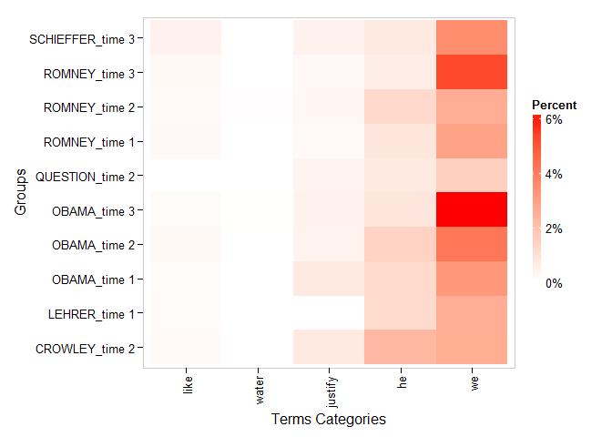
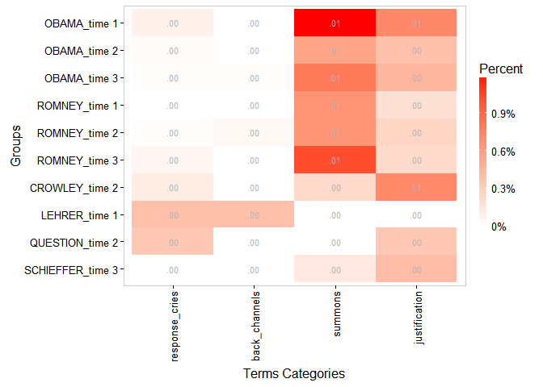
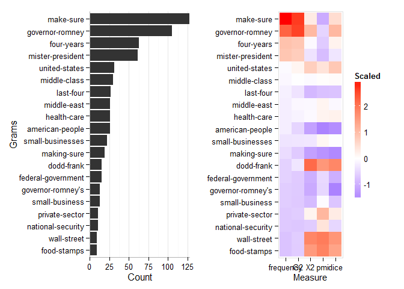
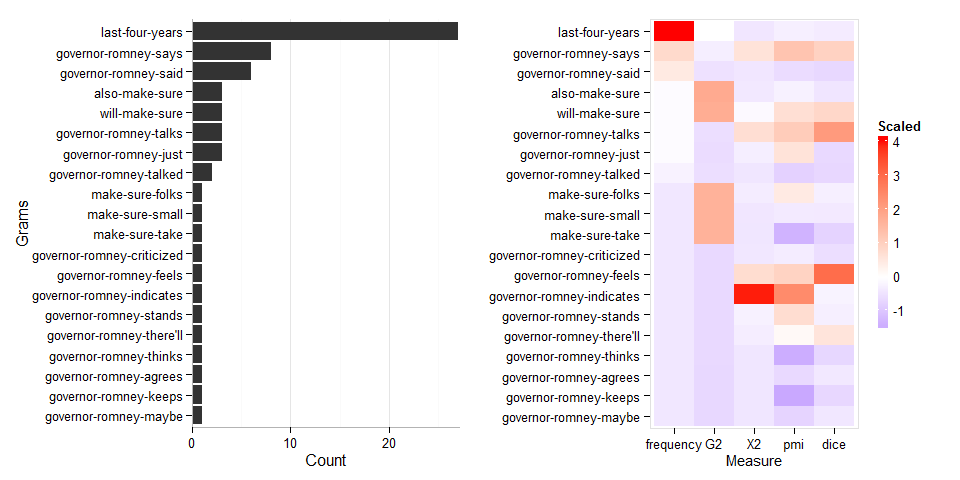
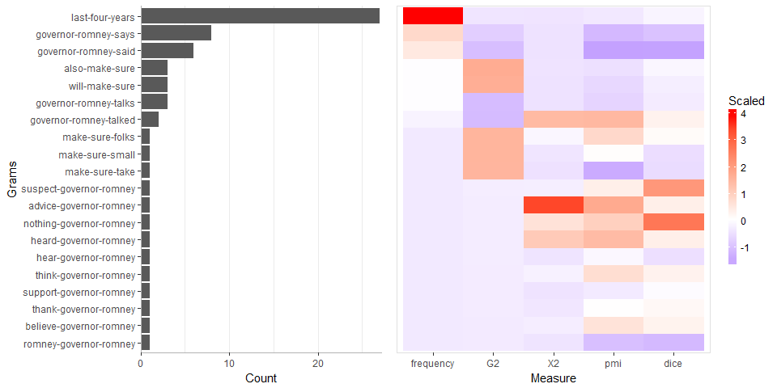
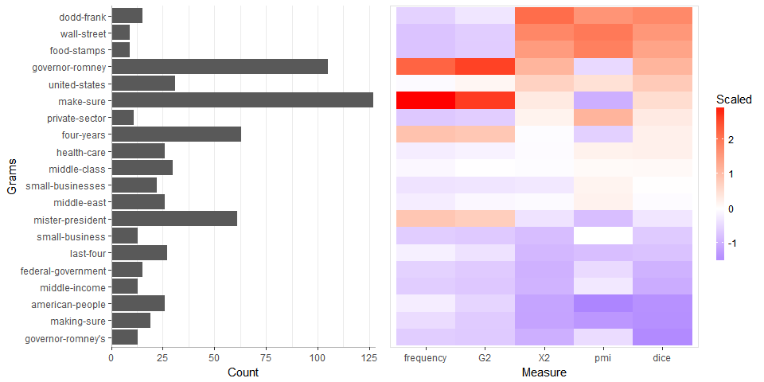
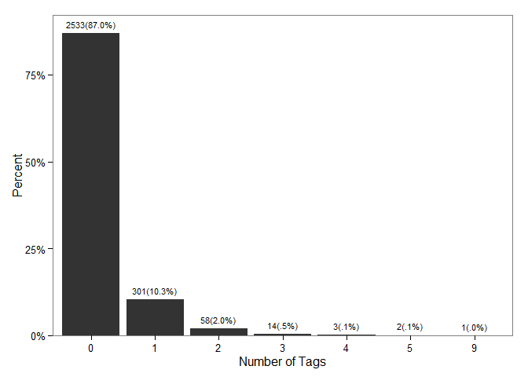
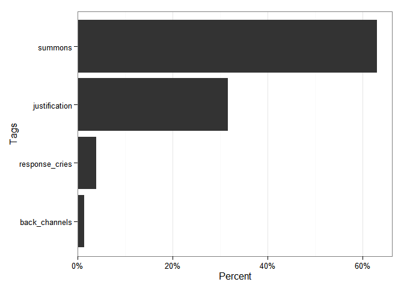
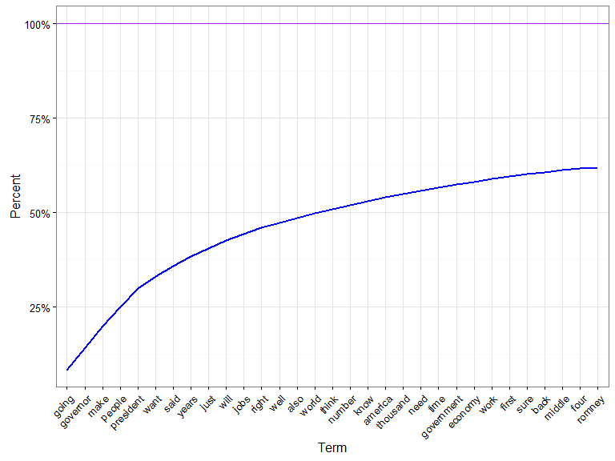

termco
============

**termco** is A small suite of functions used to count and find terms
and substrings in strings. The tools can be used to build an expert
rules, regular expression based text classification model. The package
wraps the
[**data.table**](https://cran.r-project.org/package=data.table) and
[**stringi**](https://cran.r-project.org/package=stringi) packages to
create fast data frame counts of regular expression terms and
substrings.

Table of Contents
============

-   [[Functions](#functions)](#[functions](#functions))
-   [[Installation](#installation)](#[installation](#installation))
-   [[Contact](#contact)](#[contact](#contact))
-   [[Examples](#examples)](#[examples](#examples))
    -   [[Load the Tools/Data](#load-the-toolsdata)](#[load-the-toolsdata](#load-the-toolsdata))
    -   [[Build Counts Dataframe](#build-counts-dataframe)](#[build-counts-dataframe](#build-counts-dataframe))
    -   [[Printing](#printing)](#[printing](#printing))
    -   [[Plotting](#plotting)](#[plotting](#plotting))
    -   [[Ngram Collocations](#ngram-collocations)](#[ngram-collocations](#ngram-collocations))
        -   [[Collocation Plotting](#collocation-plotting)](#[collocation-plotting](#collocation-plotting))
-   [[Building an Expert Rules, Regex Classifier Model](#building-an-expert-rules-regex-classifier-model)](#[building-an-expert-rules-regex-classifier-model](#building-an-expert-rules-regex-classifier-model))
    -   [[Load the Tools/Data](#load-the-toolsdata-1)](#[load-the-toolsdata](#load-the-toolsdata-1))
    -   [[Splitting Data](#splitting-data)](#[splitting-data](#splitting-data))
    -   [[Understanding Term Use](#understanding-term-use)](#[understanding-term-use](#understanding-term-use))
        -   [[View Most Used Words](#view-most-used-words)](#[view-most-used-words](#view-most-used-words))
        -   [[View Most Used Words in Context](#view-most-used-words-in-context)](#[view-most-used-words-in-context](#view-most-used-words-in-context))
    -   [[Building the Model](#building-the-model)](#[building-the-model](#building-the-model))
    -   [[Testing the Model](#testing-the-model)](#[testing-the-model](#testing-the-model))
    -   [[Improving the Model](#improving-the-model)](#[improving-the-model](#improving-the-model))
    -   [[Categorizing/Tagging](#categorizingtagging)](#[categorizingtagging](#categorizingtagging))
    -   [[Accuracy](#accuracy)](#[accuracy](#accuracy))

Functions
============

The main function of **termco** is `term_count`. It is used to extract
regex term counts by grouping variable(s) as well as to generate
classification models.

Most of the functions *count*, *search*, *plot* terms, and *covert*
between output types, while a few remaining functions are used to train,
test and interpret *model*s. Additionally, the `probe_` family of
function generate lists of function calls or plots for given search
terms. The table below describes the functions, category of use, and
their description:

<table style="width:136%;">
<colgroup>
<col width="43%" />
<col width="20%" />
<col width="72%" />
</colgroup>
<thead>
<tr class="header">
<th align="left">Function</th>
<th align="left">Use Category</th>
<th align="left">Description</th>
</tr>
</thead>
<tbody>
<tr class="odd">
<td align="left"><code>term_count</code></td>
<td align="left">count</td>
<td align="left">Count regex term occurrence; modeling</td>
</tr>
<tr class="even">
<td align="left"><code>frequent_terms</code>/<code>all_words</code></td>
<td align="left">count</td>
<td align="left">Frequent terms</td>
</tr>
<tr class="odd">
<td align="left"><code>hierarchical_coverage</code></td>
<td align="left">count</td>
<td align="left">Unique coverage of a text vector by terms</td>
</tr>
<tr class="even">
<td align="left"><code>ngram_collocations</code></td>
<td align="left">count</td>
<td align="left">Weighted frequent ngram (2 &amp; 3) collocations</td>
</tr>
<tr class="odd">
<td align="left"><code>word_count</code></td>
<td align="left">count</td>
<td align="left">Count words</td>
</tr>
<tr class="even">
<td align="left"><code>colo</code></td>
<td align="left">search</td>
<td align="left">Regex output to find term collocations</td>
</tr>
<tr class="odd">
<td align="left"><code>search_term</code></td>
<td align="left">search</td>
<td align="left">Search for regex terms</td>
</tr>
<tr class="even">
<td align="left"><code>classification_project</code></td>
<td align="left">modeling</td>
<td align="left">Make a classification modeling project template</td>
</tr>
<tr class="odd">
<td align="left"><code>split_data</code></td>
<td align="left">modeling</td>
<td align="left">Split data into <code>train</code> &amp; <code>test</code> sets</td>
</tr>
<tr class="even">
<td align="left"><code>accuracy</code></td>
<td align="left">modeling</td>
<td align="left">Check accuracy of model against human coder</td>
</tr>
<tr class="odd">
<td align="left"><code>classify</code></td>
<td align="left">modeling</td>
<td align="left">Assign n tags to text from a model</td>
</tr>
<tr class="even">
<td align="left"><code>coverage</code></td>
<td align="left">modeling</td>
<td align="left">Coverage for <code>term_count</code> or <code>search_term</code> object</td>
</tr>
<tr class="odd">
<td align="left"><code>uncovered</code>/<code>get_uncovered</code></td>
<td align="left">modeling</td>
<td align="left">Get the uncovered text rom a model</td>
</tr>
<tr class="even">
<td align="left"><code>as_count</code></td>
<td align="left">convert</td>
<td align="left">Strip pretty printing from <code>term_count</code> object</td>
</tr>
<tr class="odd">
<td align="left"><code>as_terms</code></td>
<td align="left">convert</td>
<td align="left">Convert a count matrix to list of term vectors</td>
</tr>
<tr class="even">
<td align="left"><code>weight</code></td>
<td align="left">convert</td>
<td align="left">Weight a <code>term_count</code> object proportion/percent</td>
</tr>
<tr class="odd">
<td align="left"><code>plot_ca</code></td>
<td align="left">plot</td>
<td align="left">Plot <code>term_count</code> object as 3-D correspondence analysis map</td>
</tr>
<tr class="even">
<td align="left"><code>plot_counts</code></td>
<td align="left">plot</td>
<td align="left">Horizontal bar plot of group counts</td>
</tr>
<tr class="odd">
<td align="left"><code>plot_freq</code></td>
<td align="left">plot</td>
<td align="left">Vertical bar plot of frequencies of counts</td>
</tr>
<tr class="even">
<td align="left"><code>plot_cum_percent</code></td>
<td align="left">plot</td>
<td align="left">Plot <code>frequent_terms</code> object as cumulative percent</td>
</tr>
<tr class="odd">
<td align="left"><code>probe_list</code></td>
<td align="left">probe</td>
<td align="left">Generate list of <code>search_term</code> function calls</td>
</tr>
<tr class="even">
<td align="left"><code>probe_colo_list</code></td>
<td align="left">probe</td>
<td align="left">Generate list of <code>search_term</code> + <code>frequent_terms</code> function calls</td>
</tr>
<tr class="odd">
<td align="left"><code>probe_colo_plot_list</code></td>
<td align="left">probe</td>
<td align="left">Generate list of <code>search_term</code> + <code>frequent_terms</code> + <code>plot</code> function calls</td>
</tr>
<tr class="even">
<td align="left"><code>probe_colo_plot</code></td>
<td align="left">probe</td>
<td align="left">Plot <code>probe_colo_plot_list</code> directly</td>
</tr>
</tbody>
</table>

Installation
============

To download the development version of **termco**:

Download the [zip
ball](https://github.com/trinker/termco/zipball/master) or [tar
ball](https://github.com/trinker/termco/tarball/master), decompress and
run `R CMD INSTALL` on it, or use the **pacman** package to install the
development version:

    if (!require("pacman")) install.packages("pacman")
    pacman::p_load_gh("trinker/termco")

Contact
=======

You are welcome to: 
* submit suggestions and bug-reports at: <https://github.com/trinker/termco/issues> 
* send a pull request on: <https://github.com/trinker/termco/> 
* compose a friendly e-mail to: <tyler.rinker@gmail.com>

Examples
========

The following examples demonstrate some of the functionality of
**termco**.

Load the Tools/Data
-------------------

    if (!require("pacman")) install.packages("pacman")
    pacman::p_load(dplyr, ggplot2, termco)

    data(presidential_debates_2012)

Build Counts Dataframe
----------------------

    discoure_markers <- list(
        response_cries = c("\\boh", "\\bah", "aha", "ouch", "yuk"),
        back_channels = c("uh[- ]huh", "uhuh", "yeah"),
        summons = "hey",
        justification = "because"
    )

    counts <- presidential_debates_2012 %>%
        with(term_count(dialogue, grouping.var = list(person, time), discoure_markers))

    counts

    ## Coverage: 100% 
    ## Source: local data frame [10 x 7]
    ## 
    ##       person   time n.words back_channels justification response_cries
    ##       (fctr) (fctr)   (int)         (chr)         (chr)          (chr)
    ## 1      OBAMA time 1    3599             0      26(.72%)        3(.08%)
    ## 2      OBAMA time 2    7477             0      29(.39%)        2(.03%)
    ## 3      OBAMA time 3    7243       1(.01%)      33(.46%)        1(.01%)
    ## 4     ROMNEY time 1    4085             0       8(.20%)              0
    ## 5     ROMNEY time 2    7536       3(.04%)      20(.27%)        1(.01%)
    ## 6     ROMNEY time 3    8303             0      19(.23%)        5(.06%)
    ## 7    CROWLEY time 2    1672             0      12(.72%)        2(.12%)
    ## 8     LEHRER time 1     765       3(.39%)             0        3(.39%)
    ## 9   QUESTION time 2     583             0       2(.34%)        2(.34%)
    ## 10 SCHIEFFER time 3    1445             0       6(.42%)              0
    ## Variables not shown: summons (chr)

Printing
--------

    print(counts, pretty = FALSE)

    ## Coverage: 100% 
    ## Source: local data frame [10 x 7]
    ## 
    ##       person   time n.words response_cries back_channels summons
    ##       (fctr) (fctr)   (int)          (int)         (int)   (int)
    ## 1      OBAMA time 1    3599              3             0      43
    ## 2      OBAMA time 2    7477              2             0      42
    ## 3      OBAMA time 3    7243              1             1      58
    ## 4     ROMNEY time 1    4085              0             0      27
    ## 5     ROMNEY time 2    7536              1             3      49
    ## 6     ROMNEY time 3    8303              5             0      84
    ## 7    CROWLEY time 2    1672              2             0       4
    ## 8     LEHRER time 1     765              3             3       0
    ## 9   QUESTION time 2     583              2             0       0
    ## 10 SCHIEFFER time 3    1445              0             0       2
    ## Variables not shown: justification (int)

    print(counts, zero.replace = "_")

    ## Coverage: 100% 
    ## Source: local data frame [10 x 7]
    ## 
    ##       person   time n.words back_channels justification response_cries
    ##       (fctr) (fctr)   (int)         (chr)         (chr)          (chr)
    ## 1      OBAMA time 1    3599             _      26(.72%)        3(.08%)
    ## 2      OBAMA time 2    7477             _      29(.39%)        2(.03%)
    ## 3      OBAMA time 3    7243       1(.01%)      33(.46%)        1(.01%)
    ## 4     ROMNEY time 1    4085             _       8(.20%)              _
    ## 5     ROMNEY time 2    7536       3(.04%)      20(.27%)        1(.01%)
    ## 6     ROMNEY time 3    8303             _      19(.23%)        5(.06%)
    ## 7    CROWLEY time 2    1672             _      12(.72%)        2(.12%)
    ## 8     LEHRER time 1     765       3(.39%)             _        3(.39%)
    ## 9   QUESTION time 2     583             _       2(.34%)        2(.34%)
    ## 10 SCHIEFFER time 3    1445             _       6(.42%)              _
    ## Variables not shown: summons (chr)

Plotting
--------

    plot(counts)

<!-- -->

    plot(counts, labels=TRUE)

<!-- -->

    plot_ca(counts, FALSE)

<!-- -->

Ngram Collocations
------------------

**termco** wraps the [**quanteda**](https://github.com/kbenoit/quanteda)
to examine important ngram collocations. **quanteda**'s `collocation`
function provides measures of: `"G2"`, `"X2"`, `"pmi"`, and `"dice"` to
examine the strength of relationship between ngrams. **termco** adds
stopword removal, min/max character filtering, and stemming to
**quanteda**'s `collocation` as well as a generic `plot` method.

    x <- presidential_debates_2012[["dialogue"]]

    ngram_collocations(x)

    ##        term1      term2 frequency        G2        X2      pmi      dice
    ##  1:     make       sure       127 1255.7464 17863.555 4.950589 0.6827957
    ##  2: governor     romney       105 1243.1213 26609.589 5.536256 0.8366534
    ##  3:     four      years        63  657.9166 13958.627 5.404176 0.6057692
    ##  4:   mister  president        61  624.0201 10919.771 5.191794 0.4784314
    ##  5:   united     states        31  419.0626 22357.342 6.581534 0.7654321
    ##  6:   middle      class        30  366.4590 13952.244 6.143693 0.5714286
    ##  7:     last       four        27  253.2193  5140.805 5.255692 0.3698630
    ##  8:   middle       east        26  336.9210 13708.214 6.268856 0.5360825
    ##  9:   health       care        26  316.6088 13870.101 6.280845 0.6046512
    ## 10: american     people        26  193.3048  2053.071 4.387020 0.1984733
    ## 11:    small businesses        22  261.3451 11324.690 6.245445 0.5500000
    ## 12:   making       sure        19  149.6092  1899.705 4.619457 0.1890547
    ## 13:     dodd      frank        15  264.6986 37479.000 7.823486 1.0000000
    ## 14:  federal government        15  149.7619  3973.231 5.584196 0.3061224
    ## 15: governor   romney's        13  146.3850  3443.705 5.582776 0.1688312
    ## 16:    small   business        13  143.2552  5501.534 6.050709 0.3768116
    ## 17:  private     sector        11  162.2122 16424.353 7.309030 0.6285714
    ## 18: national   security        11  136.0638  7834.623 6.569857 0.4313725
    ## 19:     wall     street         9  161.5139 33730.200 8.228951 0.9473684
    ## 20:     food     stamps         9  157.5844 30663.000 8.133641 0.9000000

    ngram_collocations(x, gram.length = 3)

    ##        term1  term2      term3 frequency        G2         X2       pmi
    ##  1:     last   four      years        27  927.5627   593.7586  6.377042
    ##  2: governor romney       says         8  875.0792 19728.7724  9.192229
    ##  3: governor romney       said         6  835.9895   613.9352  5.791032
    ##  4:     also   make       sure         3 1245.9453  1057.2660  6.452585
    ##  5:     will   make       sure         3 1237.9291  6818.4983  8.130076
    ##  6: governor romney      talks         3  826.7321 21685.5103  8.882568
    ##  7: governor romney       just         3  820.2948  3166.0495  7.988257
    ##  8: governor romney     talked         2  825.0387   384.9124  5.440897
    ##  9:     make   sure      folks         1 1218.0546  2346.2809  7.700575
    ## 10:     make   sure      small         1 1217.8131   616.7290  6.243899
    ## 11:     make   sure       take         1 1217.1423   197.0394  4.460263
    ## 12: governor romney criticized         1  812.2985   793.3167  6.278270
    ## 13: governor romney      feels         1  812.2985 22172.2798  8.616865
    ## 14: governor romney  indicates         1  812.2985 83098.9284 11.324915
    ## 15: governor romney     stands         1  812.2985  3841.8656  8.189421
    ## 16: governor romney   there'll         1  812.2985  2618.9923  7.140483
    ## 17: governor romney     thinks         1  812.2985   177.0220  4.262242
    ## 18: governor romney     agrees         1  809.5322   328.0611  5.683008
    ## 19: governor romney      keeps         1  807.3197   287.3948  4.117056
    ## 20: governor romney      maybe         1  807.3197   252.7850  5.525823
    ##            dice
    ##  1: 0.002176279
    ##  2: 0.004634994
    ##  3: 0.001558846
    ##  4: 0.001951220
    ##  5: 0.004415011
    ##  6: 0.006802721
    ##  7: 0.001568627
    ##  8: 0.001520913
    ##  9: 0.002290951
    ## 10: 0.002100840
    ## 11: 0.001367989
    ## 12: 0.001749781
    ## 13: 0.008403361
    ## 14: 0.002398082
    ## 15: 0.002277904
    ## 16: 0.003898635
    ## 17: 0.001490313
    ## 18: 0.002070393
    ## 19: 0.001512859
    ## 20: 0.002036660

    ngram_collocations(x, order.by = "dice")

    ##        term1      term2 frequency        G2        X2      pmi      dice
    ##  1:     dodd      frank        15  264.6986 37479.000 7.823486 1.0000000
    ##  2:     wall     street         9  161.5139 33730.200 8.228951 0.9473684
    ##  3:     food     stamps         9  157.5844 30663.000 8.133641 0.9000000
    ##  4: governor     romney       105 1243.1213 26609.589 5.536256 0.8366534
    ##  5:   united     states        31  419.0626 22357.342 6.581534 0.7654321
    ##  6:     make       sure       127 1255.7464 17863.555 4.950589 0.6827957
    ##  7:  private     sector        11  162.2122 16424.353 7.309030 0.6285714
    ##  8:     four      years        63  657.9166 13958.627 5.404176 0.6057692
    ##  9:   health       care        26  316.6088 13870.101 6.280845 0.6046512
    ## 10:   middle      class        30  366.4590 13952.244 6.143693 0.5714286
    ## 11:    small businesses        22  261.3451 11324.690 6.245445 0.5500000
    ## 12:   middle       east        26  336.9210 13708.214 6.268856 0.5360825
    ## 13:   mister  president        61  624.0201 10919.771 5.191794 0.4784314
    ## 14: national   security        11  136.0638  7834.623 6.569857 0.4313725
    ## 15:    small   business        13  143.2552  5501.534 6.050709 0.3768116
    ## 16:     last       four        27  253.2193  5140.805 5.255692 0.3698630
    ## 17:  federal government        15  149.7619  3973.231 5.584196 0.3061224
    ## 18: american     people        26  193.3048  2053.071 4.387020 0.1984733
    ## 19:   making       sure        19  149.6092  1899.705 4.619457 0.1890547
    ## 20: governor   romney's        13  146.3850  3443.705 5.582776 0.1688312

### Collocation Plotting

    plot(ngram_collocations(x))

<!-- -->

    plot(ngram_collocations(x), drop.redundant.yaxis.text = FALSE)

<!-- -->

    plot(ngram_collocations(x, gram.length = 3))

<!-- -->

    plot(ngram_collocations(x, order.by = "dice"))

<!-- -->

Building an Expert Rules, Regex Classifier Model
================================================

Machine learning models of classification are great when you have known
tags to train with because the model scales. Qualitative, expert based
human coding is terrific for when you have no tagged data. However, when
you have a larger, untagged data set the machine learning approaches
have no outcome to learn from and the data is too large to classify by
hand. One solution is to use a expert rules, regular expression approach
that is somewhere between machine learning and hand coding. This is one
solution for tagging larger, untagged data sets. Additionally, when each
text element contains larger chunks of text, unsupervised clustering
type algorithms such as k-means or topic modeling may be of use.

This example section highlights the types of function combinations and
order for a typical expert rules classification. This task typically
involves the combined use of available literature, close examinations of
term usage within text, and researcher experience. Building a classifier
model requires the researcher to build a list of regular expressions
that map to a category or tag. Below I outline minimal work flow for
classification.

Note that the user may want to begin with a classification model
template that contains subdirectories and files for a classification
project. The `classification_project` generates this template with a
pre-populated *'classification.R'* script that can guide the user
through the modeling process. The directory tree looks like the
following:

    template
        |
        |   .Rproj
        |   
        +---categories
        |       categories.R
        |       
        +---data
        +---output
        +---plots
        +---reports
        \---scripts
                01_data_cleaning.R
                02_classification.R

Load the Tools/Data
-------------------

    if (!require("pacman")) install.packages("pacman")
    pacman::p_load(dplyr, ggplot2, termco)

    data(presidential_debates_2012)

Splitting Data
--------------

Many classification techniques require the data to be split into a
training and test set to allow the researcher to observe how a model
will perform on a new data set. This also prevents over-fitting the
data. The `split_data` function allows easy splitting of `data.frame` or
`vector` data by integer or proportion. The function returns a named
list of the data set into a `train` and `test` set. The printed view is
a truncated version of the returned list with `|...` indicating there
are additional observations.

    set.seed(111)
    (pres_deb_split <- split_data(presidential_debates_2012, .75))

    ## split_data:
    ## 
    ## train: n = 2184
    ## Source: local data frame [6 x 5]
    ## 
    ##      person    tot   time      role
    ##      (fctr)  (chr) (fctr)    (fctr)
    ## 1   CROWLEY  230.2 time 2 moderator
    ## 2 SCHIEFFER   48.1 time 3 moderator
    ## 3    ROMNEY  98.15 time 2 candidate
    ## 4    ROMNEY 173.12 time 2 candidate
    ## 5     OBAMA  102.6 time 2 candidate
    ## 6     OBAMA 120.16 time 2 candidate
    ## Variables not shown: dialogue (chr)
    ## |...
    ## 
    ## test: n = 728
    ## Source: local data frame [6 x 5]
    ## 
    ##   person   tot   time      role
    ##   (fctr) (chr) (fctr)    (fctr)
    ## 1 LEHRER   1.1 time 1 moderator
    ## 2 ROMNEY   2.2 time 1 candidate
    ## 3 ROMNEY   4.4 time 1 candidate
    ## 4 ROMNEY   4.5 time 1 candidate
    ## 5 ROMNEY   4.7 time 1 candidate
    ## 6 ROMNEY  4.17 time 1 candidate
    ## Variables not shown: dialogue (chr)
    ## |...

The training set can be accessed via `pres_deb_split$train`; likewise,
the test set can be accessed by way of `pres_deb_split$train`.

Here I show splitting by integer.

    split_data(presidential_debates_2012, 100)

    ## split_data:
    ## 
    ## train: n = 100
    ## Source: local data frame [6 x 5]
    ## 
    ##   person    tot   time      role
    ##   (fctr)  (chr) (fctr)    (fctr)
    ## 1  OBAMA  102.4 time 2 candidate
    ## 2 ROMNEY 122.26 time 3 candidate
    ## 3 ROMNEY 166.16 time 3 candidate
    ## 4 ROMNEY 162.18 time 3 candidate
    ## 5  OBAMA   20.3 time 2 candidate
    ## 6 ROMNEY  59.12 time 1 candidate
    ## Variables not shown: dialogue (chr)
    ## |...
    ## 
    ## test: n = 2812
    ## Source: local data frame [6 x 5]
    ## 
    ##   person   tot   time      role
    ##   (fctr) (chr) (fctr)    (fctr)
    ## 1 LEHRER   1.1 time 1 moderator
    ## 2 LEHRER   1.2 time 1 moderator
    ## 3 ROMNEY   2.1 time 1 candidate
    ## 4 ROMNEY   2.2 time 1 candidate
    ## 5 LEHRER   3.1 time 1 moderator
    ## 6 ROMNEY   4.1 time 1 candidate
    ## Variables not shown: dialogue (chr)
    ## |...

I could have trained on the training set and tested on the testing set
in the following examples around modeling but have chosen not too for
simplicity.

Understanding Term Use
----------------------

In order to build the named list of regular expressions that map to a
category/tag the researcher must understand the terms (particularly
information salient terms) in context. The understanding of term use
helps the researcher to begin to build a mental model of the topics
being used in a fashion similar to qualitative coding techniques. Broad
categories will begin to coalesce as word use is elucidated. It forms
the initial names of the "named list of regular expressions". Of course
building the regular expressions in the regex model building step will
allow the researcher to see new ways in which terms are used as well as
new important terms. This in turn will reshape, remove, and add names to
the "named list of regular expressions". This recursive process is
captured in the model below.

### View Most Used Words

A common task in building a model is to understand the most frequent
words while excluding less information rich function words. The
`frequnt_terms` function produces an ordered data frame of counts. The
researcher can exclude stop words and limit the terms to contain n
characters between set thresholds. The output is ordered by most to
least frequent n terms but can be rearranged alphabetically.

    presidential_debates_2012 %>%
        with(frequent_terms(dialogue))

    ##    term      frequency
    ## 1  going     271      
    ## 2  make      217      
    ## 3  people    214      
    ## 4  governor  204      
    ## 5  president 194      
    ## 6  said      178      
    ## 7  want      173      
    ## 8  sure      156      
    ## 9  just      134      
    ## 10 will      125      
    ## 11 years     118      
    ## 12 jobs      116      
    ## 13 romney    110      
    ## 14 also      102      
    ## 15 know       97      
    ## 16 four       94      
    ## 17 world      92      
    ## 18 well       91      
    ## 19 right      88      
    ## 20 think      88

    presidential_debates_2012 %>%
        with(frequent_terms(dialogue, 40)) %>%
        plot()

<!-- -->

A cumulative percent can give a different view of the term usage. The
`plot_cum_percent` function converts a `frequent_terms` output into a
cumulative percent plot. Additionally, `ngram_collocations` + `plot` can
give insight into the frequently occurring ngrams.

    presidential_debates_2012 %>%
        with(frequent_terms(dialogue, 40)) %>%
        plot_cum_percent()

<!-- -->

It may also be helpful to view the unique contribution of terms on the
coverage excluding all elements from the match vector that were
previously matched by another term. The `hierarchical_coverage` and
accompanying `plot` method allows for hierarchical exploration of the
unique coverage of terms.

    terms <- presidential_debates_2012 %>%
        with(frequent_terms(dialogue, 30)) %>%
        `[[`("term")

    presidential_debates_2012 %>%
        with(hierarchical_coverage(dialogue, terms))

    ##          term       unique cumulative
    ## 1       going 0.0834478022  0.0834478
    ## 2    governor 0.0583791209  0.1418269
    ## 3        make 0.0576923077  0.1995192
    ## 4      people 0.0515109890  0.2510302
    ## 5   president 0.0480769231  0.2991071
    ## 6        want 0.0305631868  0.3296703
    ## 7        said 0.0295329670  0.3592033
    ## 8       years 0.0240384615  0.3832418
    ## 9        just 0.0223214286  0.4055632
    ## 10       will 0.0212912088  0.4268544
    ## 11       jobs 0.0164835165  0.4433379
    ## 12      right 0.0157967033  0.4591346
    ## 13       well 0.0144230769  0.4735577
    ## 14       also 0.0127060440  0.4862637
    ## 15      world 0.0116758242  0.4979396
    ## 16      think 0.0113324176  0.5092720
    ## 17     number 0.0109890110  0.5202610
    ## 18       know 0.0106456044  0.5309066
    ## 19    america 0.0099587912  0.5408654
    ## 20   thousand 0.0085851648  0.5494505
    ## 21       need 0.0082417582  0.5576923
    ## 22       time 0.0082417582  0.5659341
    ## 23 government 0.0082417582  0.5741758
    ## 24    economy 0.0075549451  0.5817308
    ## 25       work 0.0068681319  0.5885989
    ## 26      first 0.0065247253  0.5951236
    ## 27       sure 0.0058379121  0.6009615
    ## 28       back 0.0058379121  0.6067995
    ## 29     middle 0.0054945055  0.6122940
    ## 30       four 0.0051510989  0.6174451
    ## 31     romney 0.0003434066  0.6177885

    presidential_debates_2012 %>%
        with(hierarchical_coverage(dialogue, terms)) %>%
        plot(use.terms = TRUE)

<!-- -->

### View Most Used Words in Context

Much of the exploration of terms in context in effort to build the named
list of regular expressions that map to a category/tag involves
recursive views of frequent terms in context. The `probe` family of
functions can generate lists of function calls (and copy them to the
clipboard for easy transfer) allowing the user to circulate through term
lists generated from other **termco** tools such as `frequent_terms`.
This is meant to standardize and speed up the process.

The first `probe_` tool makes a list of function calls for `search_term`
using a term list. Here I show just 10 terms from `frequent_terms`. This
can be pasted into a script and then run line by line to explore the
frequent terms in context.

    presidential_debates_2012 %>%
        with(frequent_terms(dialogue, 10)) %>%
        select(term) %>%
        unlist() %>%
        probe_list("presidential_debates_2012$dialogue") 

    ## search_term(presidential_debates_2012$dialogue, "going")
    ## search_term(presidential_debates_2012$dialogue, "make")
    ## search_term(presidential_debates_2012$dialogue, "people")
    ## search_term(presidential_debates_2012$dialogue, "governor")
    ## search_term(presidential_debates_2012$dialogue, "president")
    ## search_term(presidential_debates_2012$dialogue, "said")
    ## search_term(presidential_debates_2012$dialogue, "want")
    ## search_term(presidential_debates_2012$dialogue, "sure")
    ## search_term(presidential_debates_2012$dialogue, "just")
    ## search_term(presidential_debates_2012$dialogue, "will")

The next `probe_` function wraps `search_term` with `frequent_terms`.
This allows the user to systematically explore the words that frequently
colocate with the original terms.

    presidential_debates_2012 %>%
        with(frequent_terms(dialogue, 5)) %>%
        select(term) %>%
        unlist() %>%
        probe_colo_list("presidential_debates_2012$dialogue") 

    ## frequent_terms(search_term(presidential_debates_2012$dialogue, "going"))
    ## frequent_terms(search_term(presidential_debates_2012$dialogue, "make"))
    ## frequent_terms(search_term(presidential_debates_2012$dialogue, "people"))
    ## frequent_terms(search_term(presidential_debates_2012$dialogue, "governor"))
    ## frequent_terms(search_term(presidential_debates_2012$dialogue, "president"))

As `frequent_terms` has a `plot` method the user may wish to generate
function calls similar to `probe_colo_list` but wrapped with `plot` for
a visual exploration of the data. The `probe_colo_plot_list` makes a
list of such function calls, whereas the `probe_colo_plot` plots the
output directly to a single external .pdf file.

    presidential_debates_2012 %>%
        with(frequent_terms(dialogue, 5)) %>%
        select(term) %>%
        unlist() %>%
        probe_colo_plot_list("presidential_debates_2012$dialogue") 

    ## plot(frequent_terms(search_term(presidential_debates_2012$dialogue, "going")))
    ## plot(frequent_terms(search_term(presidential_debates_2012$dialogue, "make")))
    ## plot(frequent_terms(search_term(presidential_debates_2012$dialogue, "people")))
    ## plot(frequent_terms(search_term(presidential_debates_2012$dialogue, "governor")))
    ## plot(frequent_terms(search_term(presidential_debates_2012$dialogue, "president")))

The plots can be generated externally with the `probe_colo_plot`
function which makes multi-page .pdf of frequent terms bar plots; one
plot for each term.

    presidential_debates_2012 %>%
        with(frequent_terms(dialogue, 5)) %>%
        select(term) %>%
        unlist() %>%
        probe_colo_plot("presidential_debates_2012$dialogue") 

Building the Model
------------------

To build a model the researcher created a named list of regular
expressions that map to a category/tag. This is fed to the `term_count`
function. `term_count` allows for aggregation by grouping variables but
for building the model we usually want to get observation level counts.
Set `grouping.var = TRUE` to generate an `id` column of 1 through number
of observation which gives the researcher the observation level counts.

    discoure_markers <- list(
        response_cries = c("\\boh", "\\bah", "aha", "ouch", "yuk"),
        back_channels = c("uh[- ]huh", "uhuh", "yeah"),
        summons = "hey",
        justification = "because"
    )

    model <- presidential_debates_2012 %>%
        with(term_count(dialogue, grouping.var = TRUE, discoure_markers))

    model

    ## Coverage: 13.02% 
    ## Source: local data frame [2,912 x 6]
    ## 
    ##       id n.words back_channels justification response_cries   summons
    ##    (int)   (int)         (chr)         (chr)          (chr)     (chr)
    ## 1      1      10             0             0              0         0
    ## 2      2       9             0             0      1(11.11%)         0
    ## 3      3      14             0             0              0         0
    ## 4      4      14             0             0              0         0
    ## 5      5       5             0             0      1(20.00%)         0
    ## 6      6       5             0             0              0         0
    ## 7      7      40             0             0              0         0
    ## 8      8       2             0             0              0         0
    ## 9      9      20             0             0              0 2(10.00%)
    ## 10    10      13             0             0              0  1(7.69%)
    ## ..   ...     ...           ...           ...            ...       ...

Testing the Model
-----------------

In building a classifier the researcher is typically concerned with
coverage, discrimination, and accuracy. The first two are easier to
obtain while accuracy is not possible to compute without a comparison
sample of expertly tagged data.

We want our model to be assigning tags to as many of the text elements
as possible. The `coverage` function can provide an understanding of
what percent of the data is tagged. Our model has relatively low
coverage, indicating the regular expression model needs to be improved.

    model %>%
        coverage()

    ## Coverage:    13.02%
    ## Coverered:   379
    ## Not Covered: 2533

Understanding how well our model discriminates is important as well. We
want the model to cover as close to 100% of the data as possible, but
likely want fewer tags assigned to each element. If the model is tagging
many tags to each element it is not able to discriminate well. The
`as_terms` + `plot_freq` function provides a visual representation of
the model's ability to discriminate. The output is a bar plot showing
the distribution of the number of tags at the element level. The goal is
to have a larger density at 1 tag. Note that the plot also gives a view
of coverage, as the zero bar shows the frequency of elements that could
not be tagged. Our model has a larger distribution of 1 tag compared to
the &gt;1 tag distributions, though the coverage is very poor. As the
number of tags increases the ability of the model to discriminate
typically lessens. There is often a trade off between model coverage and
discrimination.

    model %>%
        as_terms() %>%
        plot_freq(size=3) + xlab("Number of Tags")

<!-- -->

We may also want to see the distribution of the tags as well. The
combination of `as_terms` + `plot_counts` gives the distribution of the
tags. In our model the majority of tags are applied to the **summons**
category.

    model %>%
        as_terms() %>%
        plot_counts() + xlab("Tags")

<!-- -->

Improving the Model
-------------------

The model does not have very good coverage. To improve this the
researcher will want to look at the data with no coverage to try to
build additional regular expressions and categories. This requires
understanding language, noticing additional features of the data with no
coverage that may map to categories, and building regular expressions to
model these features. This section will outline some of the tools that
can be used to detect features and build regular expressions to model
these language features.

We first want to view the untagged data. The `uncovered` function
provides a logical vector that can be used to exctract the text with no
tags.

    untagged <- get_uncovered(model)

    head(untagged)

    ## [1] "We'll talk about specifically about health care in a moment."                                                                                                                                              
    ## [2] "What I support is no change for current retirees and near retirees to Medicare."                                                                                                                           
    ## [3] "And the president supports taking dollar seven hundred sixteen billion out of that program."                                                                                                               
    ## [4] "So that's that's number one."                                                                                                                                                                              
    ## [5] "Number two is for people coming along that are young, what I do to make sure that we can keep Medicare in place for them is to allow them either to choose the current Medicare program or a private plan."
    ## [6] "Their choice."

The `frequent_terms` function can be used again to understand common
features of the untagged data.

    untagged %>%
        frequent_terms()

    ##    term      frequency
    ## 1  going     211      
    ## 2  governor  177      
    ## 3  president 172      
    ## 4  people    169      
    ## 5  make      166      
    ## 6  said      149      
    ## 7  want      130      
    ## 8  sure      110      
    ## 9  just      107      
    ## 10 will      103      
    ## 11 years     101      
    ## 12 jobs       96      
    ## 13 romney     95      
    ## 14 know       82      
    ## 15 four       81      
    ## 16 also       78      
    ## 17 america    77      
    ## 18 right      76      
    ## 19 well       74      
    ## 20 world      72

We may see a common term such as the word *right* and want to see what
other terms collocate with it. Using a regular expression that searches
for multiple terms can improve a model's accuracy and ability to
discriminate. Using `search_term` in combination with `frequent_terms`
can be a powerful way to see which words tend to collocate. Here I pass
a regex for *right* (`\\bright`) to `search_term`. This pulls up the
text that contains this term. I then use `frequent_terms` to see what
words frequently occur with the word *right*. We notice the word
*people* tends to occur with *right*.

    untagged %>%
        search_term("\\bright") %>%
        frequent_terms(10, stopwords = "right")

    ##    term       frequency
    ## 1  that       32       
    ## 2  have       12       
    ## 3  people     10       
    ## 4  with        9       
    ## 5  this        8       
    ## 6  government  7       
    ## 7  course      6       
    ## 8  going       6       
    ## 9  it's        6       
    ## 10 president   6       
    ## 11 that's      6       
    ## 12 want        6       
    ## 13 you're      6

This is an exploratory act. Finding the right combination of features
that occur together requires lots of recursive noticing, trialling,
testing, reading, interpreting, and deciding. After we noticed that the
terms *people* and *course* appear with the term *right* above we will
want to see these text elements. We can use a grouped-or expression with
`colo` to build a regular expression that will search for any text
elements that contain these two terms anywhere. `colo` is more powerful
than initially shown here; I demonstrate further functionality below.
Here is the regex produced.

    colo("\\bright", "(people|course)")

    ## [1] "(\\bright.*(people|course)|(people|course).*\\bright)"

This is extremely powerful when used inside of `search_term` as the text
containing this regular expression will be returned along with the
coverage proportion on the uncovered data.

    search_term(untagged, colo("\\bright", "(people|course)"))

    ##  [1] "Right now, the CBO says up to twenty million people will lose their insurance as Obamacare goes into effect next year."                                                                                                                                                                                                  
    ##  [2] "The federal government taking over health care for the entire nation and whisking aside the tenth Amendment, which gives states the rights for these kinds of things, is not the course for America to have a stronger, more vibrant economy."                                                                           
    ##  [3] "And what we're seeing right now is, in my view, a a trickle down government approach, which has government thinking it can do a better job than free people pursuing their drea Miss And it's not working."                                                                                                              
    ##  [4] "And the challenges America faces right now look, the reason I'm in this race is there are people that are really hurting today in this country."                                                                                                                                                                         
    ##  [5] "It's going to help people across the country that are unemployed right now."                                                                                                                                                                                                                                             
    ##  [6] "That's not the right course for America."                                                                                                                                                                                                                                                                                
    ##  [7] "The right course for America is to have a true all of the above policy."                                                                                                                                                                                                                                                 
    ##  [8] "When you've got thousands of people right now in Iowa, right now in Colorado, who are working, creating wind power with good paying manufacturing jobs, and the Republican senator in that in Iowa is all for it, providing tax breaks to help this work and Governor Romney says I'm opposed."                          
    ##  [9] "When it comes to community colleges, we are setting up programs, including with Nassau Community College, to retrain workers, including young people who may have dropped out of school but now are getting another chance, training them for the jobs that exist right now."                                            
    ## [10] "That's not the right course for us."                                                                                                                                                                                                                                                                                     
    ## [11] "The right course for us is to make sure that we go after the the people who are leaders of these various anti American groups and these these jihadists, but also help the Muslim world."                                                                                                                                
    ## [12] "And so the right course for us, is working through our partners and with our own resources, to identify responsible parties within Syria, organize them, bring them together in a in a form of if not government, a form of of of council that can take the lead in Syria."                                              
    ## [13] "And it's widely reported that drones are being used in drone strikes, and I support that and entirely, and feel the president was right to up the usage of that technology, and believe that we should continue to use it, to continue to go after the people that represent a threat to this nation and to our friends."
    ## [14] "People can look it up, you're right."                                                                                                                                                                                                                                                                                    
    ## [15] "Those are the kinds of choices that the American people face right now."                                                                                                                                                                                                                                                 
    ## attr(,"coverage")
    ## [1] 0.005921832

We notice right away that the phrase *right course* appears often. We
can create a search with just this expression.

***Note*** *that the decision to include a regular expression in the
model is up to the researcher. We must guard against overfitting the
model, making it not transferable to new, similar contexts.*

    search_term(untagged, "right course")

    ## [1] "That's not the right course for America."                                                                                                                                                                                                                                  
    ## [2] "The right course for America is to have a true all of the above policy."                                                                                                                                                                                                   
    ## [3] "That's not the right course for us."                                                                                                                                                                                                                                       
    ## [4] "The right course for us is to make sure that we go after the the people who are leaders of these various anti American groups and these these jihadists, but also help the Muslim world."                                                                                  
    ## [5] "And so the right course for us, is working through our partners and with our own resources, to identify responsible parties within Syria, organize them, bring them together in a in a form of if not government, a form of of of council that can take the lead in Syria."
    ## attr(,"coverage")
    ## [1] 0.001973944

Based on the `frequent_terms` output above, the word *jobs* also seems
important. Again, we use the `search_term` + `frequent_terms` combo to
extract words collocating with *jobs*.

    search_term(untagged, "jobs") %>%
        frequent_terms(15, stopwords = "jobs")

    ##    term     frequency
    ## 1  that     48       
    ## 2  million  17       
    ## 3  create   15       
    ## 4  going    15       
    ## 5  this     15       
    ## 6  we're    14       
    ## 7  here     13       
    ## 8  back     12       
    ## 9  have     12       
    ## 10 country  11       
    ## 11 that's   11       
    ## 12 people   10       
    ## 13 make      9       
    ## 14 sure      9       
    ## 15 five      8       
    ## 16 hundred   8       
    ## 17 overseas  8       
    ## 18 want      8       
    ## 19 with      8       
    ## 20 years     8

As stated above, `colo` is a powerful search tool as it can take
multiple regular expressions as well as allowing for multiple negations
(i.e., find x but not if y). To include multiple negations use a
grouped-or regex as shown below.

    ## Where do `jobs` and `create` collocate?
    search_term(untagged, colo("jobs", "create")) 

    ##  [1] "If I'm president I will create help create twelve million new jobs in this country with rising incomes."                                                                                                                                                                     
    ##  [2] "I know what it takes to create good jobs again."                                                                                                                                                                                                                             
    ##  [3] "And what I want to do, is build on the five million jobs that we've created over the last thirty months in the private sector alone."                                                                                                                                        
    ##  [4] "It's going to help those families, and it's going to create incentives to start growing jobs again in this country."                                                                                                                                                         
    ##  [5] "We created twenty three million new jobs."                                                                                                                                                                                                                                   
    ##  [6] "two million new jobs created."                                                                                                                                                                                                                                               
    ##  [7] "We've created five million jobs, and gone from eight hundred jobs a month being lost, and we are making progress."                                                                                                                                                           
    ##  [8] "He keeps saying, Look, I've created five million jobs."                                                                                                                                                                                                                      
    ##  [9] "eight percent, between that period the end of that recession and the equivalent of time to today, Ronald Reagan's recovery created twice as many jobs as this president's recovery."                                                                                         
    ## [10] "This is the way we're going to create jobs in this country."                                                                                                                                                                                                                 
    ## [11] "We have to be competitive if we're going to create more jobs here."                                                                                                                                                                                                          
    ## [12] "We need to create jobs here."                                                                                                                                                                                                                                                
    ## [13] "And it's estimated that that will create eight hundred thousand new jobs."                                                                                                                                                                                                   
    ## [14] "That's not the way we're going to create jobs here."                                                                                                                                                                                                                         
    ## [15] "The way we're going to create jobs here is not just to change our tax code, but also to double our exports."                                                                                                                                                                 
    ## [16] "That's going to help to create jobs here."                                                                                                                                                                                                                                   
    ## [17] "Government does not create jobs."                                                                                                                                                                                                                                            
    ## [18] "Government does not create jobs."                                                                                                                                                                                                                                            
    ## [19] "Barry, I think a lot of this campaign, maybe over the last four years, has been devoted to this nation that I think government creates jobs, that that somehow is the answer."                                                                                               
    ## [20] "And when it comes to our economy here at home, I know what it takes to create twelve million new jobs and rising take home pay."                                                                                                                                             
    ## [21] "And Governor Romney wants to take us back to those policies, a foreign policy that's wrong and reckless, economic policies that won't create jobs, won't reduce our deficit, but will make sure that folks at the very top don't have to play by the same rules that you do."
    ## attr(,"coverage")
    ## [1] 0.008290565

    ## Where do `jobs`, `create`,  and the word `not` collocate?
    search_term(untagged, colo("jobs", "create", "(not|'nt)")) 

    ## [1] "That's not the way we're going to create jobs here."                                                        
    ## [2] "The way we're going to create jobs here is not just to change our tax code, but also to double our exports."
    ## [3] "Government does not create jobs."                                                                           
    ## [4] "Government does not create jobs."                                                                           
    ## attr(,"coverage")
    ## [1] 0.001579155

    ## Where do `jobs` and`create` collocate without a `not` word?
    search_term(untagged, colo("jobs", "create", not = "(not|'nt)")) 

    ##  [1] "If I'm president I will create help create twelve million new jobs in this country with rising incomes."                                                                                                                                                                     
    ##  [2] "I know what it takes to create good jobs again."                                                                                                                                                                                                                             
    ##  [3] "And what I want to do, is build on the five million jobs that we've created over the last thirty months in the private sector alone."                                                                                                                                        
    ##  [4] "It's going to help those families, and it's going to create incentives to start growing jobs again in this country."                                                                                                                                                         
    ##  [5] "We created twenty three million new jobs."                                                                                                                                                                                                                                   
    ##  [6] "two million new jobs created."                                                                                                                                                                                                                                               
    ##  [7] "We've created five million jobs, and gone from eight hundred jobs a month being lost, and we are making progress."                                                                                                                                                           
    ##  [8] "He keeps saying, Look, I've created five million jobs."                                                                                                                                                                                                                      
    ##  [9] "eight percent, between that period the end of that recession and the equivalent of time to today, Ronald Reagan's recovery created twice as many jobs as this president's recovery."                                                                                         
    ## [10] "This is the way we're going to create jobs in this country."                                                                                                                                                                                                                 
    ## [11] "We have to be competitive if we're going to create more jobs here."                                                                                                                                                                                                          
    ## [12] "We need to create jobs here."                                                                                                                                                                                                                                                
    ## [13] "And it's estimated that that will create eight hundred thousand new jobs."                                                                                                                                                                                                   
    ## [14] "That's going to help to create jobs here."                                                                                                                                                                                                                                   
    ## [15] "Barry, I think a lot of this campaign, maybe over the last four years, has been devoted to this nation that I think government creates jobs, that that somehow is the answer."                                                                                               
    ## [16] "And when it comes to our economy here at home, I know what it takes to create twelve million new jobs and rising take home pay."                                                                                                                                             
    ## [17] "And Governor Romney wants to take us back to those policies, a foreign policy that's wrong and reckless, economic policies that won't create jobs, won't reduce our deficit, but will make sure that folks at the very top don't have to play by the same rules that you do."
    ## attr(,"coverage")
    ## [1] 0.006711409

    ## Where do `jobs`, `romney`, and `create` collocate?
    search_term(untagged, colo("jobs", "create", "romney")) 

    ## [1] "And Governor Romney wants to take us back to those policies, a foreign policy that's wrong and reckless, economic policies that won't create jobs, won't reduce our deficit, but will make sure that folks at the very top don't have to play by the same rules that you do."
    ## attr(,"coverage")
    ## [1] 0.0003947888

Here is one more example with `colo` for the words *jobs* and
*overseas*. The user may want to quickly test and then transfer the
regex created by `colo` to the regular expression list. By setting
`options(termco.copy2clip = TRUE)` the user globally sets `colo` to use
the **clipr** package to copy the regex to the clipboard for better work
flow.

    search_term(untagged, colo("jobs", "overseas")) 

    ## [1] "And everything that I've tried to do, and everything that I'm now proposing for the next four years in terms of improving our education system or developing American energy or making sure that we're closing loopholes for companies that are shipping jobs overseas and focusing on small businesses and companies that are creating jobs here in the United States, or closing our deficit in a responsible, balanced way that allows us to invest in our future."
    ## [2] "You can ship jobs overseas and get tax breaks for it."                                                                                                                                                                                                                                                                                                                                                                                                                
    ## [3] "The outsourcing of American jobs overseas has taken a toll on our economy."                                                                                                                                                                                                                                                                                                                                                                                           
    ## [4] "Making sure that we're bringing manufacturing back to our shores so that we're creating jobs here, as we've done with the auto industry, not rewarding companies that are shipping jobs overseas."                                                                                                                                                                                                                                                                    
    ## [5] "I know Americans had seen jobs being shipped overseas; businesses and workers not getting a level playing field when it came to trade."                                                                                                                                                                                                                                                                                                                               
    ## [6] "Having a tax code that rewards companies that are shipping jobs overseas instead of companies that are investing here in the United States, that will not make us more competitive."                                                                                                                                                                                                                                                                                  
    ## [7] "And the one thing that I'm absolutely clear about is that after a decade in which we saw drift, jobs being shipped overseas, nobody championing American workers and American businesses, we've now begun to make some real progress."                                                                                                                                                                                                                                
    ## [8] "And I've put forward a plan to make sure that we're bringing manufacturing jobs back to our shores by rewarding companies and small businesses that are investing here, not overseas."                                                                                                                                                                                                                                                                                
    ## attr(,"coverage")
    ## [1] 0.00315831

The researcher uses an iterative process to continue to build the
regular expression list. The `term_count` function builds the matrix of
counts to further test the model. The use of (a) `coverage`, (b)
`as_terms` + `plot_counts`, and (c) `as_terms` + `freq_counts` will
allow for continued testing of model functioning.

Categorizing/Tagging
--------------------

The `classify` function enables the researcher to apply *n* tags to each
text element. Depending on the text and the regular expression list's
ability, multiple tags may be applied to a text. The `n` argument allows
the maximum number of tags to be set though the function does not
guarantee this many (or any) tags will be assigned.

Here I show the `head` of the returned vector (if `n` &gt; 1 a `list`
may be returned) as well as a `table` and plot of the counts. Use
`n = Inf` to return all tags.

    classify(model) %>%
        head()

    ## [1] NA               "response_cries" NA               NA              
    ## [5] "response_cries" NA

    classify(model) %>%
        unlist() %>%
        table()

    ## .
    ##  back_channels  justification response_cries        summons 
    ##              6            124             17            232

    classify(model) %>%
        unlist() %>%
        plot_counts() + xlab("Tags")

<!-- -->

Accuracy
--------

The user may be interested in testing the accuracy of the model against
a known, human coded sample. The `accuracy` function allows the
researcher to test a model's accuracy. In the example below I randomly
generate "known human coded tagged" vector. Obviously, this is for
demonstration purposes. The model outputs a pretty printing of a list.
The printing contains:

<table style="width:111%;">
<colgroup>
<col width="29%" />
<col width="66%" />
<col width="15%" />
</colgroup>
<thead>
<tr class="header">
<th align="left">Printed</th>
<th align="left">Description</th>
<th align="left">Accessed</th>
</tr>
</thead>
<tbody>
<tr class="odd">
<td align="left"><strong>N</strong></td>
<td align="left">The number of text elements (<code>N</code>)</td>
<td align="left"></td>
</tr>
<tr class="even">
<td align="left"><strong>Exact</strong></td>
<td align="left">Perfect one to one correspondence between whole vectors in <code>tagged</code> &amp; <code>known</code></td>
<td align="left"><code>$exact</code></td>
</tr>
<tr class="odd">
<td align="left"><strong>Ordered</strong></td>
<td align="left">Proportion of the elements in <code>tagged</code> matching <code>known</code> exactly; order matters</td>
<td align="left"><code>$ordered</code></td>
</tr>
<tr class="even">
<td align="left"><strong>Adjusted</strong></td>
<td align="left">An adjusted mean score of <strong>Ordered</strong> and <strong>unordered</strong></td>
<td align="left"><code>$adjusted</code></td>
</tr>
<tr class="odd">
<td align="left"><strong>Unordered</strong></td>
<td align="left">Proportion of the elements in <code>tagged</code> matching <code>known</code> regardless of order</td>
<td align="left"><code>$unordered</code></td>
</tr>
</tbody>
</table>

Note that if classify is constrained to `n = 1` then all scores will be
identical. If a larger, known tagging is available the user may want to
strongly consider machine learning models (see:
[**RTextTools**](https://cran.r-project.org/package=RTextTools)).

This minimal example will provide insight into the way the accuracy
scores behave:

    known <- list(1:3, 3, NA, 4:5, 2:4, 5, integer(0))
    tagged <- list(1:3, 3, 4, 5:4, c(2, 4:3), 5, integer(0))
    accuracy(tagged, known)

    ## N:         7
    ## Exact:     42.9%
    ## Ordered:   47.6%
    ## Adjusted:  59.5%
    ## Unordered: 71.4%

Below we create fake "known" tags to test `accuracy` with real data
(though the comparison is fabricated).

    mod1 <- presidential_debates_2012 %>%
        with(term_count(dialogue, TRUE, discoure_markers)) %>%
        classify()

    fake_known <- mod1
    set.seed(1)
    fake_known[sample(1:length(fake_known), 300)] <- "random noise"

    accuracy(mod1, fake_known)

    ## N:         2912
    ## Exact:     89.7%
    ## Ordered:   89.7%
    ## Adjusted:  89.7%
    ## Unordered: 89.7%

In this model we allow for `n = 3` tags to be assigned in the
classification. This enables the potential for a (in this case
*slightly*) better a **Adjusted** value. The adjusted value upweights
based on correctly applying a tag regardless of the position of that tag
(`classify` gives higher preference to tags that have a higher term
count for that text element; order for ties is broken randomly).

    mod2 <- presidential_debates_2012 %>%
        with(term_count(dialogue, TRUE, discoure_markers)) %>%
        classify(n = 3)

    fake_known2 <- mod2
    multi <- sapply(fake_known2, length) > 1
    set.seed(1)
    fake_known2[multi] <- lapply(fake_known2[multi], sample)

    accuracy(mod2, fake_known2)

    ## N:         2912
    ## Exact:     99.4%
    ## Ordered:   99.4%
    ## Adjusted:  99.7%
    ## Unordered: 100.0%

These examples give guidance on how to use the tools in the **termco**
package to build an expert rules, regular expression text classification
model.