termco   
============

**termco** is a suite of functions used to count and find terms and
substrings in strings. The tools can be used to build an expert rules,
regular expression based text classification model. The package wraps
the [**data.table**](https://cran.r-project.org/package=data.table) and
[**stringi**](https://cran.r-project.org/package=stringi) packages to
create fast data frame counts of regular expression terms and
substrings.

Table of Contents
============

-   [Functions](#functions)
-   [Installation](#installation)
-   [Contact](#contact)
-   [Examples](#examples)
    -   [Load the Tools/Data](#load-the-toolsdata)
    -   [Build Counts Dataframe](#build-counts-dataframe)
    -   [Printing](#printing)
    -   [Plotting](#plotting)
    -   [Ngram Collocations](#ngram-collocations)
        -   [Collocation Plotting](#collocation-plotting)
    -   [Converting to Document Term Matrix](#converting-to-document-term-matrix)
-   [Building an Expert Rules, Regex Classifier Model](#building-an-expert-rules-regex-classifier-model)
    -   [Load the Tools/Data](#load-the-toolsdata-1)
    -   [Splitting Data](#splitting-data)
    -   [Understanding Term Use](#understanding-term-use)
        -   [View Most Used Words](#view-most-used-words)
        -   [View Most Used Words in Context](#view-most-used-words-in-context)
        -   [View Important Words](#view-important-words)
    -   [Building the Model](#building-the-model)
    -   [Testing the Model](#testing-the-model)
    -   [Improving the Model](#improving-the-model)
        -   [Improving Coverage](#improving-coverage)
        -   [Improving Discrimination](#improving-discrimination)
    -   [Categorizing/Tagging](#categorizingtagging)
    -   [Evaluation: Accuracy](#evaluation-accuracy)
        -   [Pre Coded Data](#pre-coded-data)
        -   [Post Coding Data](#post-coding-data)

Functions
============

The main function of **termco** is `term_count`. It is used to extract
regex term counts by grouping variable(s) as well as to generate
classification models.

Most of the functions *count*, *search*, *plot* terms, and *covert*
between output types, while a few remaining functions are used to train,
test and interpret *model*s. Additionally, the `probe_` family of
function generate lists of function calls or plots for given search
terms. The table below describes the functions, category of use, and
their description:

<table>
<colgroup>
<col width="31%" />
<col width="15%" />
<col width="53%" />
</colgroup>
<thead>
<tr class="header">
<th>Function</th>
<th>Use Category</th>
<th>Description</th>
</tr>
</thead>
<tbody>
<tr class="odd">
<td><code>term_count</code></td>
<td>count</td>
<td>Count regex term occurrence; modeling</td>
</tr>
<tr class="even">
<td><code>token_count</code></td>
<td>count</td>
<td>Count fixed token occurrence; modeling</td>
</tr>
<tr class="odd">
<td><code>frequent_terms</code>/<code>all_words</code></td>
<td>count</td>
<td>Frequent terms</td>
</tr>
<tr class="even">
<td><code>important_terms</code></td>
<td>count</td>
<td>Important terms</td>
</tr>
<tr class="odd">
<td><code>hierarchical_coverage_term</code></td>
<td>count</td>
<td>Unique coverage of a text vector by terms</td>
</tr>
<tr class="even">
<td><code>hierarchical_coverage_regex</code></td>
<td>count</td>
<td>Unique coverage of a text vector by regex</td>
</tr>
<tr class="odd">
<td><code>frequent_ngrams</code></td>
<td>count</td>
<td>Weighted frequent ngram (2 &amp; 3) collocations</td>
</tr>
<tr class="even">
<td><code>word_count</code></td>
<td>count</td>
<td>Count words</td>
</tr>
<tr class="odd">
<td><code>term_before</code>/<code>term_after</code></td>
<td>count</td>
<td>Frequency of words before/after a regex term</td>
</tr>
<tr class="even">
<td><code>term_first</code></td>
<td>count</td>
<td>Frequency of words at the begining of strings</td>
</tr>
<tr class="odd">
<td><code>colo</code></td>
<td>search</td>
<td>Regex output to find term collocations</td>
</tr>
<tr class="even">
<td><code>search_term</code></td>
<td>search</td>
<td>Search for regex terms</td>
</tr>
<tr class="odd">
<td><code>match_word</code></td>
<td>search</td>
<td>Extract words from a text matching a regular expression</td>
</tr>
<tr class="even">
<td><code>search_term_collocations</code></td>
<td>search</td>
<td>Wrapper for <code>search_term</code> + <code>frequent_terms</code></td>
</tr>
<tr class="odd">
<td><code>classification_project</code></td>
<td>modeling</td>
<td>Make a classification modeling project template</td>
</tr>
<tr class="even">
<td><code>classification_template</code></td>
<td>modeling</td>
<td>Make a classification analysis script template</td>
</tr>
<tr class="odd">
<td><code>as_dtm</code>/<code>as_tdm</code></td>
<td>modeling</td>
<td>Coerce <code>term_count</code> object into <code>tm::DocumentTermMatrix</code>/<code>tm::TermDocumentMatrix</code></td>
</tr>
<tr class="even">
<td><code>split_data</code></td>
<td>modeling</td>
<td>Split data into <code>train</code> &amp; <code>test</code> sets</td>
</tr>
<tr class="odd">
<td><code>evaluate</code></td>
<td>modeling</td>
<td>Check accuracy of model against human coder</td>
</tr>
<tr class="even">
<td><code>classify</code></td>
<td>modeling</td>
<td>Assign n tags to text from a model</td>
</tr>
<tr class="odd">
<td><code>get_text</code></td>
<td>modeling</td>
<td>Get the original text for model tags</td>
</tr>
<tr class="even">
<td><code>coverage</code></td>
<td>modeling</td>
<td>Coverage for <code>term_count</code> or <code>search_term</code> object</td>
</tr>
<tr class="odd">
<td><code>uncovered</code>/<code>get_uncovered</code></td>
<td>modeling</td>
<td>Get the uncovered text from a model</td>
</tr>
<tr class="even">
<td><code>mutate_counts</code></td>
<td>modeling</td>
<td>Apply normalizing function to term count columns</td>
</tr>
<tr class="odd">
<td><code>tag_co_occurrence</code></td>
<td>modeling</td>
<td>Explore co-occurrence of tags from a model</td>
</tr>
<tr class="even">
<td><code>validate_model</code>/<code>assign_validation_task</code></td>
<td>modeling</td>
<td>Human validation of a <code>term_count</code> model</td>
</tr>
<tr class="odd">
<td><code>read_term_list</code></td>
<td>read/write</td>
<td>Read a term list from an external file</td>
</tr>
<tr class="even">
<td><code>write_term_list</code></td>
<td>read/write</td>
<td>Write a term list to an external file</td>
</tr>
<tr class="odd">
<td><code>term_list_template</code></td>
<td>read/write</td>
<td>Write a term list template to an external file</td>
</tr>
<tr class="even">
<td><code>as_count</code></td>
<td>convert</td>
<td>Strip pretty printing from <code>term_count</code> object</td>
</tr>
<tr class="odd">
<td><code>as_terms</code></td>
<td>convert</td>
<td>Convert a count matrix to list of term vectors</td>
</tr>
<tr class="even">
<td><code>as_term_list</code></td>
<td>convert</td>
<td>Convert a vector of terms into a named term list</td>
</tr>
<tr class="odd">
<td><code>weight</code></td>
<td>convert</td>
<td>Weight a <code>term_count</code> object proportion/percent</td>
</tr>
<tr class="even">
<td><code>plot_ca</code></td>
<td>plot</td>
<td>Plot <code>term_count</code> object as 3-D correspondence analysis map</td>
</tr>
<tr class="odd">
<td><code>plot_counts</code></td>
<td>plot</td>
<td>Horizontal bar plot of group counts</td>
</tr>
<tr class="even">
<td><code>plot_freq</code></td>
<td>plot</td>
<td>Vertical bar plot of frequencies of counts</td>
</tr>
<tr class="odd">
<td><code>plot_cum_percent</code></td>
<td>plot</td>
<td>Plot <code>frequent_terms</code> object as cumulative percent</td>
</tr>
<tr class="even">
<td><code>probe_list</code></td>
<td>probe</td>
<td>Generate list of <code>search_term</code> function calls</td>
</tr>
<tr class="odd">
<td><code>probe_colo_list</code></td>
<td>probe</td>
<td>Generate list of <code>search_term_collocations</code> function calls</td>
</tr>
<tr class="even">
<td><code>probe_colo_plot_list</code></td>
<td>probe</td>
<td>Generate list of <code>search_term_collocationss</code> + <code>plot</code> function calls</td>
</tr>
<tr class="odd">
<td><code>probe_colo_plot</code></td>
<td>probe</td>
<td>Plot <code>probe_colo_plot_list</code> directly</td>
</tr>
</tbody>
</table>

Installation
============

To download the development version of **termco**:

Download the [zip
ball](https://github.com/trinker/termco/zipball/master) or [tar
ball](https://github.com/trinker/termco/tarball/master), decompress and
run `R CMD INSTALL` on it, or use the **pacman** package to install the
development version:

    if (!require("pacman")) install.packages("pacman")
    pacman::p_load_gh(
        "trinker/gofastr",
        "trinker/termco"
    )

Contact
=======

You are welcome to:    
- submit suggestions and bug-reports at: <https://github.com/trinker/termco/issues>    
- send a pull request on: <https://github.com/trinker/termco/>    
- compose a friendly e-mail to: <tyler.rinker@gmail.com>    

Examples
========

The following examples demonstrate some of the functionality of
**termco**.

Load the Tools/Data
-------------------

    if (!require("pacman")) install.packages("pacman")
    pacman::p_load(dplyr, ggplot2, termco)

    data(presidential_debates_2012)

Build Counts Dataframe
----------------------

    discoure_markers <- list(
        response_cries = c("\\boh", "\\bah", "aha", "ouch", "yuk"),
        back_channels = c("uh[- ]huh", "uhuh", "yeah"),
        summons = "hey",
        justification = "because"
    )

    counts <- presidential_debates_2012 %>%
        with(term_count(dialogue, grouping.var = list(person, time), discoure_markers))

    counts

    ## Coverage: 100% 
    ## # A tibble: 10 x 7
    ##    person time  n.words response_cries back_channels summons justification
    ##    <fct>  <fct>   <int> <chr>          <chr>         <chr>   <chr>        
    ##  1 OBAMA  time~    3599 3(.08%)        0             43(1.1~ 26(.72%)     
    ##  2 OBAMA  time~    7477 2(.03%)        0             42(.56~ 29(.39%)     
    ##  3 OBAMA  time~    7243 1(.01%)        1(.01%)       58(.80~ 33(.46%)     
    ##  4 ROMNEY time~    4085 0              0             27(.66~ 8(.20%)      
    ##  5 ROMNEY time~    7536 1(.01%)        3(.04%)       49(.65~ 20(.27%)     
    ##  6 ROMNEY time~    8303 5(.06%)        0             84(1.0~ 19(.23%)     
    ##  7 CROWL~ time~    1672 2(.12%)        0             4(.24%) 12(.72%)     
    ##  8 LEHRER time~     765 3(.39%)        3(.39%)       0       0            
    ##  9 QUEST~ time~     583 2(.34%)        0             0       2(.34%)      
    ## 10 SCHIE~ time~    1445 0              0             2(.14%) 6(.42%)

Printing
--------

    print(counts, pretty = FALSE)

    ## Coverage: 100% 
    ## # A tibble: 10 x 7
    ##    person time  n.words response_cries back_channels summons justification
    ##    <fct>  <fct>   <int>          <int>         <int>   <int>         <int>
    ##  1 OBAMA  time~    3599              3             0      43            26
    ##  2 OBAMA  time~    7477              2             0      42            29
    ##  3 OBAMA  time~    7243              1             1      58            33
    ##  4 ROMNEY time~    4085              0             0      27             8
    ##  5 ROMNEY time~    7536              1             3      49            20
    ##  6 ROMNEY time~    8303              5             0      84            19
    ##  7 CROWL~ time~    1672              2             0       4            12
    ##  8 LEHRER time~     765              3             3       0             0
    ##  9 QUEST~ time~     583              2             0       0             2
    ## 10 SCHIE~ time~    1445              0             0       2             6

    print(counts, zero.replace = "_")

    ## Coverage: 100% 
    ## # A tibble: 10 x 7
    ##    person time  n.words response_cries back_channels summons justification
    ##    <fct>  <fct>   <int> <chr>          <chr>         <chr>   <chr>        
    ##  1 OBAMA  time~    3599 3(.08%)        _             43(1.1~ 26(.72%)     
    ##  2 OBAMA  time~    7477 2(.03%)        _             42(.56~ 29(.39%)     
    ##  3 OBAMA  time~    7243 1(.01%)        1(.01%)       58(.80~ 33(.46%)     
    ##  4 ROMNEY time~    4085 _              _             27(.66~ 8(.20%)      
    ##  5 ROMNEY time~    7536 1(.01%)        3(.04%)       49(.65~ 20(.27%)     
    ##  6 ROMNEY time~    8303 5(.06%)        _             84(1.0~ 19(.23%)     
    ##  7 CROWL~ time~    1672 2(.12%)        _             4(.24%) 12(.72%)     
    ##  8 LEHRER time~     765 3(.39%)        3(.39%)       _       _            
    ##  9 QUEST~ time~     583 2(.34%)        _             _       2(.34%)      
    ## 10 SCHIE~ time~    1445 _              _             2(.14%) 6(.42%)

Plotting
--------

    plot(counts)

    plot(counts, labels=TRUE)

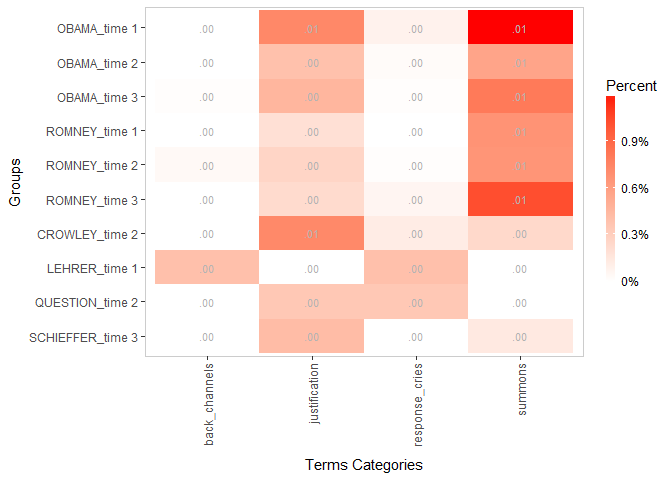

    plot_ca(counts, FALSE)

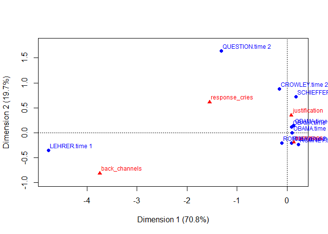

Ngram Collocations
------------------

**termco** wraps the [**quanteda**](https://github.com/kbenoit/quanteda)
package to examine important ngram collocations. **quanteda**'s
`collocation` function provides measures of: `"lambda"`, `"z"`, and
`"frequency"` to examine the strength of relationship between ngrams.
**termco** adds stopword removal, min/max character filtering, and
stemming to **quanteda**'s `collocation` as well as a generic `plot`
method.

    x <- presidential_debates_2012[["dialogue"]]

    frequent_ngrams(x)

    ##            collocation length frequency count_nested    lambda         z
    ##  1:          make sure      2       127          127  7.554897 32.834995
    ##  2:    governor romney      2       105          104  9.271292 20.461487
    ##  3:         four years      2        63           63  7.338151 28.204976
    ##  4:   mister president      2        61           51  7.834853 19.748190
    ##  5:      united states      2        31           31  9.795398 17.356448
    ##  6:       middle class      2        30           30  8.777654 16.614018
    ##  7:          last four      2        27           27  6.115321 21.912251
    ##  8:    last four years      3        27            0 -1.566379 -1.028654
    ##  9:        health care      2        26           26  8.227977 20.429621
    ## 10:    american people      2        26           26  5.120440 19.048883
    ## 11:        middle east      2        26           26 10.742379  7.485044
    ## 12:   small businesses      2        22           22  7.762762 20.244536
    ## 13:        making sure      2        19           19  5.356647 17.260131
    ## 14:     million people      2        17           17  4.780434 15.493120
    ## 15: federal government      2        15           15  6.507298 17.346209
    ## 16:       young people      2        15           15  5.624489 14.208840
    ## 17:         dodd frank      2        15           15 14.718342  7.300509
    ## 18:     small business      2        13           13  7.102122 17.040580
    ## 19:      middle income      2        13           13  6.871943 15.504096
    ## 20:  governor romney's      2        13           13  8.786176  6.091802

    frequent_ngrams(x, gram.length = 3)

    ##                 collocation length frequency count_nested     lambda
    ##  1:         last four years      3        27            0 -1.5663795
    ##  2:    twenty three million      3        11            0  4.1864145
    ##  3:   thousand nine hundred      3        11            0 -0.3498540
    ##  4:   middle class families      3        10            0 -4.2845959
    ##  5:   thousand five hundred      3         8            0 -1.1540324
    ##  6:    governor romney says      3         8            0 -4.0173427
    ##  7:    three million people      3         6            0 -0.1340563
    ##  8:         next four years      3         6            0 -0.8781626
    ##  9:    governor romney said      3         6            0 -3.3551066
    ## 10:  middle income families      3         6            0 -3.9239765
    ## 11:       five million jobs      3         5            0  2.1884488
    ## 12:         five point plan      3         5            0  2.7135106
    ## 13:   seven hundred sixteen      3         5            0  0.4756980
    ## 14: hundred sixteen billion      3         5            0  0.4265593
    ## 15:    dollar seven hundred      3         5            0 -0.6058730
    ## 16:    dollar five trillion      3         5            0 -0.8280113
    ## 17:       four years closer      3         5            0 -3.0979869
    ## 18:     forty seven million      3         4            0  0.7245824
    ## 19:   best education system      3         4            0  0.2615127
    ## 20:        rising take home      3         4            0 -0.1449834
    ##               z
    ##  1: -1.02865393
    ##  2:  1.68276560
    ##  3: -0.16798792
    ##  4: -2.63216754
    ##  5: -0.70519267
    ##  6: -2.26634962
    ##  7: -0.08481962
    ##  8: -0.42487275
    ##  9: -2.02007252
    ## 10: -2.43709086
    ## 11:  1.22412938
    ## 12:  1.22017842
    ## 13:  0.21031506
    ## 14:  0.16642917
    ## 15: -0.36134012
    ## 16: -0.39457112
    ## 17: -1.44984909
    ## 18:  0.32149800
    ## 19:  0.11938982
    ## 20: -0.06723986

    frequent_ngrams(x, order.by = "lambda")

    ##                 collocation length frequency count_nested   lambda
    ##  1:              dodd frank      2        15           15 14.71834
    ##  2:         standard bearer      2         4            4 13.48186
    ##  3:           onest century      2         3            3 13.23057
    ##  4:   intellectual property      2         3            3 13.23057
    ##  5:            joint chiefs      2         3            3 13.23057
    ##  6:            apology tour      2         3            3 13.23057
    ##  7:             wall street      2         9            9 13.13031
    ##  8:          prime minister      2         2            2 12.89412
    ##  9:      permanent resident      2         2            2 12.89412
    ## 10:         abraham lincoln      2         2            2 12.89412
    ## 11:           raton florida      2         2            2 12.89412
    ## 12:         haqqani network      2         2            2 12.89412
    ## 13:              boca raton      2         2            2 12.89412
    ## 14: unintended consequences      2         2            2 12.89412
    ## 15:      appleton wisconsin      2         2            2 12.89412
    ## 16:             food stamps      2         9            9 12.61946
    ## 17:      planned parenthood      2         5            5 12.58386
    ## 18:        self deportation      2         4            4 12.38322
    ## 19:        cleveland clinic      2         3            3 12.13193
    ## 20:    religious minorities      2         3            3 12.13193
    ##            z
    ##  1: 7.300509
    ##  2: 6.561118
    ##  3: 6.390952
    ##  4: 6.390952
    ##  5: 6.390952
    ##  6: 6.390952
    ##  7: 7.886454
    ##  8: 6.147013
    ##  9: 6.147013
    ## 10: 6.147013
    ## 11: 6.147013
    ## 12: 6.147013
    ## 13: 6.147013
    ## 14: 6.147013
    ## 15: 6.147013
    ## 16: 7.972817
    ## 17: 7.455987
    ## 18: 7.285615
    ## 19: 7.060603
    ## 20: 7.060603

### Collocation Plotting

    plot(frequent_ngrams(x))

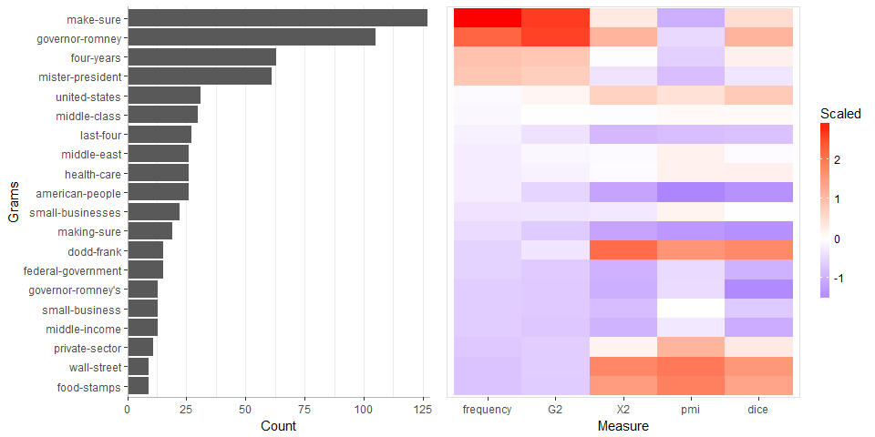

    plot(frequent_ngrams(x), drop.redundant.yaxis.text = FALSE)

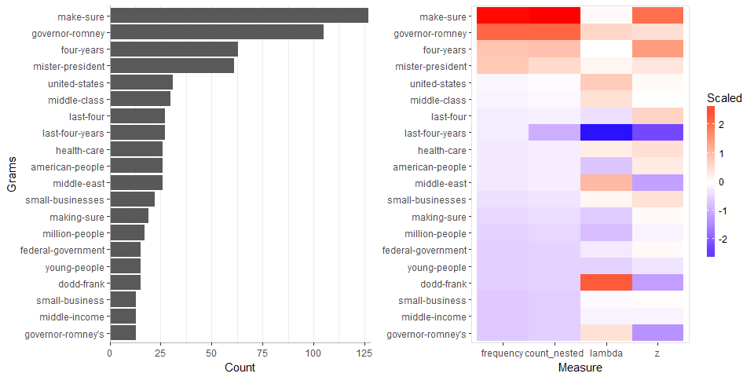

    plot(frequent_ngrams(x, gram.length = 3))

    plot(frequent_ngrams(x, order.by = "lambda"))

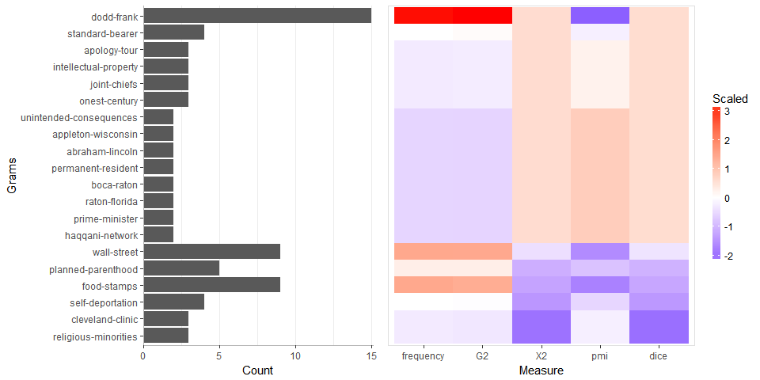

Converting to Document Term Matrix
----------------------------------

Regular expression counts can be useful features in machine learning
models. The **tm** package's `DocumentTermMatrix` is a popular data
structure for machine learning in **R**. The `as_dtm` and `as_tdm`
functions are useful for coercing the count `data.table` structure of a
`term_count` object into a `DocumentTermMatrix`/`TermDocumentMatrix`.
The result can be combined with token/word only `DocumentTermMatrix`
structures using `cbind` & `rbind`.

    as_dtm(markers)

    ## <<DocumentTermMatrix (documents: 10, terms: 4)>>
    ## Non-/sparse entries: 27/13
    ## Sparsity           : 32%
    ## Maximal term length: 14
    ## Weighting          : term frequency (tf)

    cosine_distance <- function (x, ...) {
        x <- t(slam::as.simple_triplet_matrix(x))
        stats::as.dist(1 - slam::crossprod_simple_triplet_matrix(x)/(sqrt(slam::col_sums(x^2) %*% 
            t(slam::col_sums(x^2)))))
    }

    mod <- hclust(cosine_distance(as_dtm(markers)))
    plot(mod)
    rect.hclust(mod, k = 5, border = "red")

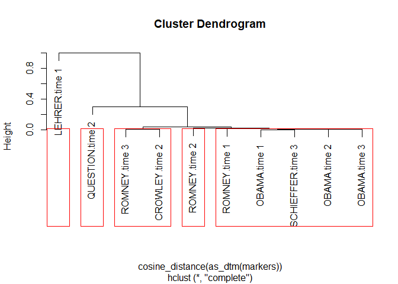

    (clusters <- cutree(mod, 5))

    ##     OBAMA.time 1     OBAMA.time 2     OBAMA.time 3    ROMNEY.time 1 
    ##                1                1                1                2 
    ##    ROMNEY.time 2    ROMNEY.time 3   CROWLEY.time 2    LEHRER.time 1 
    ##                2                2                3                4 
    ##  QUESTION.time 2 SCHIEFFER.time 3 
    ##                5                3

Building an Expert Rules, Regex Classifier Model
================================================

Machine learning models of classification are great when you have known
tags to train with because the model scales. Qualitative, expert based
human coding is terrific for when you have no tagged data. However, when
you have a larger, untagged data set the machine learning approaches
have no outcome to learn from and the data is too large to classify by
hand. One solution is to use a expert rules, regular expression approach
that is somewhere between machine learning and hand coding. This is one
solution for tagging larger, untagged data sets. Additionally, when each
text element contains larger chunks of text, [unsupervised clustering
type algorithms](https://github.com/trinker/clustext) such as k-means,
non-negative matrix factorization, hierarchical clustering, or [topic
modeling](https://github.com/trinker/topicmodels_learning) may be of use
for creating clusters that could be interpreted and treated as
categories.

This example section highlights the types of function combinations and
order for a typical expert rules classification. This task typically
involves the combined use of available literature, close examinations of
term usage within text, and researcher experience. Building a classifier
model requires the researcher to build a list of regular expressions
that map to a category or tag. Below I outline minimal work flow for
classification.

Note that the user may want to begin with a classification model
template that contains subdirectories and files for a classification
project. The `classification_project` generates this template with a
pre-populated *'classification.R'* script that can guide the user
through the modeling process. The directory tree looks like the
following:

    template
        |
        |   .Rproj
        |   
        +---categories
        |       categories.R
        |       
        +---data
        +---output
        +---plots
        +---reports
        \---scripts
                01_data_cleaning.R
                02_classification.R

Load the Tools/Data
-------------------

    if (!require("pacman")) install.packages("pacman")
    pacman::p_load(dplyr, ggplot2, termco)

    data(presidential_debates_2012)

Splitting Data
--------------

Many classification techniques require the data to be split into a
training and test set to allow the researcher to observe how a model
will perform on a new data set. This also prevents over-fitting the
data. The `split_data` function allows easy splitting of `data.frame` or
`vector` data by integer or proportion. The function returns a named
list of the data set into a `train` and `test` set. The printed view is
a truncated version of the returned list with `|...` indicating there
are additional observations.

    set.seed(111)
    (pres_deb_split <- split_data(presidential_debates_2012, .75))

    ## split_data:
    ## 
    ## train: n = 2184
    ## # A tibble: 6 x 5
    ##   person    tot    time   role      dialogue                              
    ##   <fct>     <chr>  <fct>  <fct>     <chr>                                 
    ## 1 CROWLEY   230.2  time 2 moderator Governor Romney?                      
    ## 2 SCHIEFFER 48.1   time 3 moderator you're going to get a chance to respo~
    ## 3 ROMNEY    98.15  time 2 candidate Let's have a flexible schedule so you~
    ## 4 ROMNEY    173.12 time 2 candidate But I find more troubling than this, ~
    ## 5 OBAMA     102.6  time 2 candidate You know a major difference in this c~
    ## 6 OBAMA     120.16 time 2 candidate Making sure that we are controlling o~
    ## |...
    ## 
    ## test: n = 728
    ## # A tibble: 6 x 5
    ##   person tot   time   role      dialogue                                  
    ##   <fct>  <chr> <fct>  <fct>     <chr>                                     
    ## 1 LEHRER 1.1   time 1 moderator We'll talk about specifically about healt~
    ## 2 ROMNEY 2.2   time 1 candidate And the president supports taking dollar ~
    ## 3 ROMNEY 4.4   time 1 candidate They get to choose and they'll have at le~
    ## 4 ROMNEY 4.5   time 1 candidate So they don't have to pay additional mone~
    ## 5 ROMNEY 4.7   time 1 candidate They'll have at least two plans.          
    ## 6 ROMNEY 4.17  time 1 candidate That's the plan that I've put forward.    
    ## |...

The training set can be accessed via `pres_deb_split$train`; likewise,
the test set can be accessed by way of `pres_deb_split$test`.

Here I show splitting by integer.

    split_data(presidential_debates_2012, 100)

    ## split_data:
    ## 
    ## train: n = 100
    ## # A tibble: 6 x 5
    ##   person tot    time   role      dialogue                                 
    ##   <fct>  <chr>  <fct>  <fct>     <chr>                                    
    ## 1 OBAMA  102.4  time 2 candidate Now, there are some other issues that ha~
    ## 2 ROMNEY 122.26 time 3 candidate I've watched year in and year out as com~
    ## 3 ROMNEY 166.16 time 3 candidate The president's path will mean continuin~
    ## 4 ROMNEY 162.18 time 3 candidate Look, I love to I love teachers, and I'm~
    ## 5 OBAMA  20.3   time 2 candidate We have increased oil production to the ~
    ## 6 ROMNEY 59.12  time 1 candidate Anybody can have deductions up to that a~
    ## |...
    ## 
    ## test: n = 2812
    ## # A tibble: 6 x 5
    ##   person tot   time   role      dialogue                                  
    ##   <fct>  <chr> <fct>  <fct>     <chr>                                     
    ## 1 LEHRER 1.1   time 1 moderator We'll talk about specifically about healt~
    ## 2 LEHRER 1.2   time 1 moderator But what do you support the voucher syste~
    ## 3 ROMNEY 2.1   time 1 candidate What I support is no change for current r~
    ## 4 ROMNEY 2.2   time 1 candidate And the president supports taking dollar ~
    ## 5 LEHRER 3.1   time 1 moderator And what about the vouchers?              
    ## 6 ROMNEY 4.1   time 1 candidate So that's that's number one.              
    ## |...

I could have trained on the training set and tested on the testing set
in the following examples around modeling but have chosen not to for
simplicity.

Understanding Term Use
----------------------

In order to build the named list of regular expressions that map to a
category/tag the researcher must understand the terms (particularly
information salient terms) in context. The understanding of term use
helps the researcher to begin to build a mental model of the topics
being used in a fashion similar to qualitative coding techniques. Broad
categories will begin to coalesce as word use is elucidated. It forms
the initial names of the "named list of regular expressions". Of course
building the regular expressions in the regex model building step will
allow the researcher to see new ways in which terms are used as well as
new important terms. This in turn will reshape, remove, and add names to
the "named list of regular expressions". This recursive process is
captured in the model below.

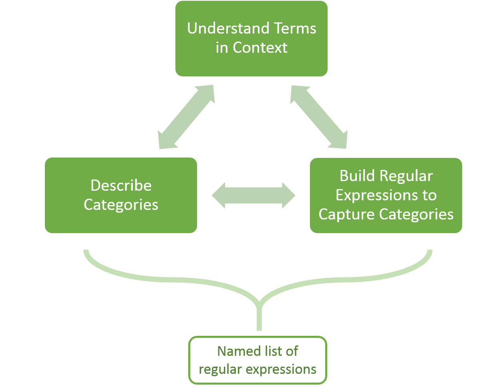

### View Most Used Words

A common task in building a model is to understand the most frequent
words while excluding less information rich function words. The
`frequnt_terms` function produces an ordered data frame of counts. The
researcher can exclude stop words and limit the terms to contain n
characters between set thresholds. The output is ordered by most to
least frequent n terms but can be rearranged alphabetically.

    presidential_debates_2012 %>%
        with(frequent_terms(dialogue))

    ##    term      frequency
    ## 1  going     271      
    ## 2  make      217      
    ## 3  people    214      
    ## 4  governor  204      
    ## 5  president 194      
    ## 6  said      178      
    ## 7  want      173      
    ## 8  sure      156      
    ## 9  just      134      
    ## 10 years     118      
    ## 11 jobs      116      
    ## 12 romney    110      
    ## 13 also      102      
    ## 14 know       97      
    ## 15 four       94      
    ## 16 world      92      
    ## 17 well       91      
    ## 18 right      88      
    ## 19 think      88      
    ## 20 america    87

    presidential_debates_2012 %>%
        with(frequent_terms(dialogue, 40)) %>%
        plot()

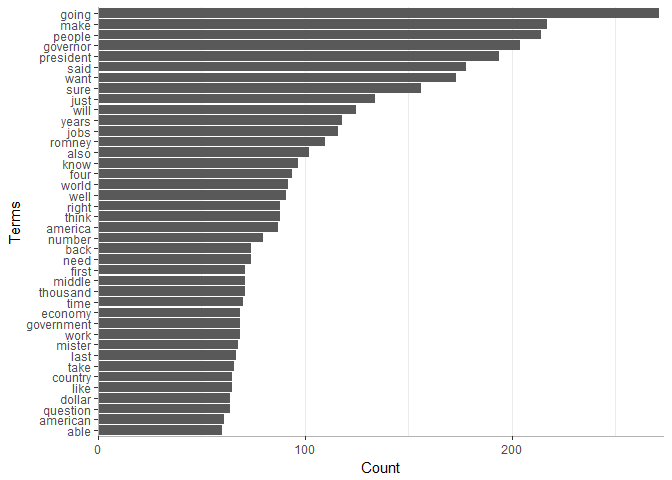

A cumulative percent can give a different view of the term usage. The
`plot_cum_percent` function converts a `frequent_terms` output into a
cumulative percent plot. Additionally, `frequent_ngrams` + `plot` can
give insight into the frequently occurring ngrams.

    presidential_debates_2012 %>%
        with(frequent_terms(dialogue, 40)) %>%
        plot_cum_percent()

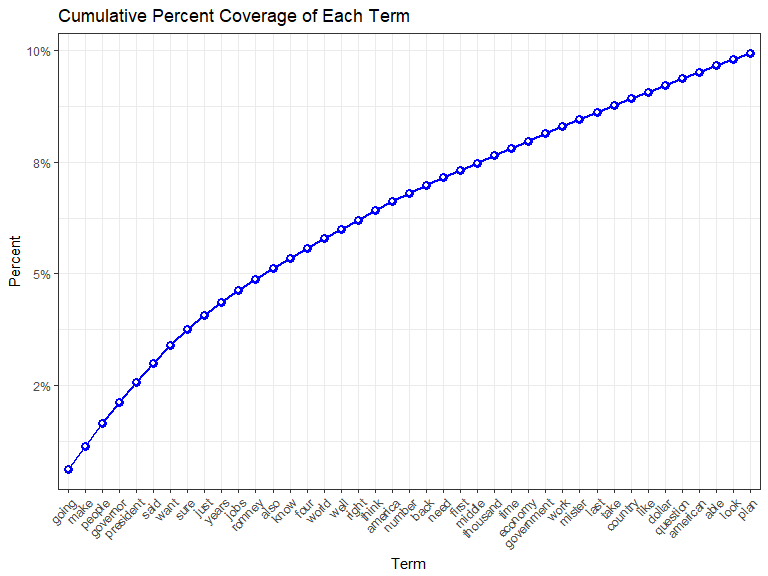

It may also be helpful to view the unique contribution of terms on the
coverage excluding all elements from the match vector that were
previously matched by another term. The `hierarchical_coverage_term` and
accompanying `plot` method allows for hierarchical exploration of the
unique coverage of terms.

    terms <- presidential_debates_2012 %>%
        with(frequent_terms(dialogue, 30)) %>%
        `[[`("term")

    presidential_debates_2012 %>%
        with(hierarchical_coverage_term(dialogue, terms))

    ##          term       unique cumulative
    ## 1       going 0.0834478022  0.0834478
    ## 2        make 0.0576923077  0.1411401
    ## 3      people 0.0515109890  0.1926511
    ## 4    governor 0.0583791209  0.2510302
    ## 5   president 0.0480769231  0.2991071
    ## 6        said 0.0295329670  0.3286401
    ## 7        want 0.0305631868  0.3592033
    ## 8        sure 0.0058379121  0.3650412
    ## 9        just 0.0223214286  0.3873626
    ## 10      years 0.0240384615  0.4114011
    ## 11       jobs 0.0171703297  0.4285714
    ## 12     romney 0.0003434066  0.4289148
    ## 13       also 0.0140796703  0.4429945
    ## 14       know 0.0113324176  0.4543269
    ## 15       four 0.0054945055  0.4598214
    ## 16      world 0.0130494505  0.4728709
    ## 17       well 0.0147664835  0.4876374
    ## 18      right 0.0161401099  0.5037775
    ## 19      think 0.0113324176  0.5151099
    ## 20    america 0.0113324176  0.5264423
    ## 21     number 0.0109890110  0.5374313
    ## 22       back 0.0058379121  0.5432692
    ## 23       need 0.0089285714  0.5521978
    ## 24      first 0.0065247253  0.5587225
    ## 25     middle 0.0061813187  0.5649038
    ## 26   thousand 0.0085851648  0.5734890
    ## 27       time 0.0085851648  0.5820742
    ## 28    economy 0.0078983516  0.5899725
    ## 29 government 0.0082417582  0.5982143
    ## 30       work 0.0068681319  0.6050824

    presidential_debates_2012 %>%
        with(hierarchical_coverage_term(dialogue, terms)) %>%
        plot(use.terms = TRUE)

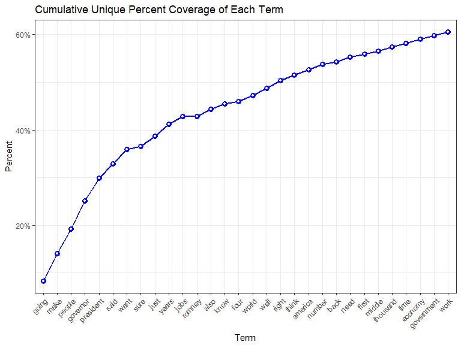

### View Most Used Words in Context

Much of the exploration of terms in context in effort to build the named
list of regular expressions that map to a category/tag involves
recursive views of frequent terms in context. The `probe` family of
functions can generate lists of function calls (and copy them to the
clipboard for easy transfer) allowing the user to circulate through term
lists generated from other **termco** tools such as `frequent_terms`.
This is meant to standardize and speed up the process.

The first `probe_` tool makes a list of function calls for `search_term`
using a term list. Here I show just 10 terms from `frequent_terms`. This
can be pasted into a script and then run line by line to explore the
frequent terms in context.

    presidential_debates_2012 %>%
        with(frequent_terms(dialogue, 10)) %>%
        select(term) %>%
        unlist() %>%
        probe_list("presidential_debates_2012$dialogue") 

    ## search_term(presidential_debates_2012$dialogue, "going")
    ## search_term(presidential_debates_2012$dialogue, "make")
    ## search_term(presidential_debates_2012$dialogue, "people")
    ## search_term(presidential_debates_2012$dialogue, "governor")
    ## search_term(presidential_debates_2012$dialogue, "president")
    ## search_term(presidential_debates_2012$dialogue, "said")
    ## search_term(presidential_debates_2012$dialogue, "want")
    ## search_term(presidential_debates_2012$dialogue, "sure")
    ## search_term(presidential_debates_2012$dialogue, "just")
    ## search_term(presidential_debates_2012$dialogue, "years")

The next `probe_` function generates a list of
`search_term_collocations` function calls (`search_term_collocations`
wraps `search_term` with `frequent_terms` and eliminates the search term
from the output). This allows the user to systematically explore the
words that frequently collocate with the original terms.

    presidential_debates_2012 %>%
        with(frequent_terms(dialogue, 5)) %>%
        select(term) %>%
        unlist() %>%
        probe_colo_list("presidential_debates_2012$dialogue") 

    ## search_term_collocations(presidential_debates_2012$dialogue, "going")
    ## search_term_collocations(presidential_debates_2012$dialogue, "make")
    ## search_term_collocations(presidential_debates_2012$dialogue, "people")
    ## search_term_collocations(presidential_debates_2012$dialogue, "governor")
    ## search_term_collocations(presidential_debates_2012$dialogue, "president")

As `search_term_collocations` has a `plot` method the user may wish to
generate function calls similar to `probe_colo_list` but wrapped with
`plot` for a visual exploration of the data. The `probe_colo_plot_list`
makes a list of such function calls, whereas the `probe_colo_plot` plots
the output directly to a single external .pdf file.

    presidential_debates_2012 %>%
        with(frequent_terms(dialogue, 5)) %>%
        select(term) %>%
        unlist() %>%
        probe_colo_plot_list("presidential_debates_2012$dialogue") 

    ## plot(search_term_collocations(presidential_debates_2012$dialogue, "going"))
    ## plot(search_term_collocations(presidential_debates_2012$dialogue, "make"))
    ## plot(search_term_collocations(presidential_debates_2012$dialogue, "people"))
    ## plot(search_term_collocations(presidential_debates_2012$dialogue, "governor"))
    ## plot(search_term_collocations(presidential_debates_2012$dialogue, "president"))

The plots can be generated externally with the `probe_colo_plot`
function which makes multi-page .pdf of frequent terms bar plots; one
plot for each term.

    presidential_debates_2012 %>%
        with(frequent_terms(dialogue, 5)) %>%
        select(term) %>%
        unlist() %>%
        probe_colo_plot("presidential_debates_2012$dialogue") 

### View Important Words

It may also be useful to view top
[min-max](http://stats.stackexchange.com/a/70807/7482) scaled tf-idf
weighted terms to allow the more information rich terms to bubble to the
top. The `important_terms` function allows the user to do exactly this.
The function works similar to `term_count` but with an information
weight.

    presidential_debates_2012 %>%
        with(important_terms(dialogue, 10))

    ##         term    tf_idf
    ## 1      going 1.0000000
    ## 2       make 0.8570324
    ## 3     people 0.8482041
    ## 4   governor 0.8110754
    ## 5        get 0.7890439
    ## 6  president 0.7873159
    ## 7       said 0.7530954
    ## 8       want 0.7510015
    ## 9        one 0.6871579
    ## 10      sure 0.6852854

Building the Model
------------------

To build a model the researcher created a named list of regular
expressions that map to a category/tag. This is fed to the `term_count`
function. `term_count` allows for aggregation by grouping variables but
for building the model we usually want to get observation level counts.
Set `grouping.var = TRUE` to generate an `id` column of 1 through number
of observation which gives the researcher the observation level counts.

    discoure_markers <- list(
        response_cries = c("\\boh", "\\bah", "aha", "ouch", "yuk"),
        back_channels = c("uh[- ]huh", "uhuh", "yeah"),
        summons = "hey",
        justification = "because"
    )

    model <- presidential_debates_2012 %>%
        with(term_count(dialogue, grouping.var = TRUE, discoure_markers))

    model

    ## Coverage: 13.02% 
    ## # A tibble: 2,912 x 6
    ##       id n.words response_cries back_channels summons justification
    ##    <int>   <int>          <int>         <int>   <int>         <int>
    ##  1     1      10              0             0       0             0
    ##  2     2       9              1             0       0             0
    ##  3     3      14              0             0       0             0
    ##  4     4      14              0             0       0             0
    ##  5     5       5              1             0       0             0
    ##  6     6       5              0             0       0             0
    ##  7     7      40              0             0       0             0
    ##  8     8       2              0             0       0             0
    ##  9     9      20              0             0       2             0
    ## 10    10      13              0             0       1             0
    ## # ... with 2,902 more rows

Testing the Model
-----------------

In building a classifier the researcher is typically concerned with
coverage, discrimination, and accuracy. The first two are easier to
obtain while accuracy is not possible to compute without a comparison
sample of expertly tagged data.

We want our model to be assigning tags to as many of the text elements
as possible. The `coverage` function can provide an understanding of
what percent of the data is tagged. Our model has relatively low
coverage, indicating the regular expression model needs to be improved.

    model %>%
        coverage()

    ## Coverage    : 13.0%
    ## Coverered   :   379
    ## Not Covered : 2,533

Understanding how well our model discriminates is important as well. We
want the model to cover as close to 100% of the data as possible, but
likely want fewer tags assigned to each element. If the model is tagging
many tags to each element it is not able to discriminate well. The
`as_terms` + `plot_freq` function provides a visual representation of
the model's ability to discriminate. The output is a bar plot showing
the distribution of the number of tags at the element level. The goal is
to have a larger density at 1 tag. Note that the plot also gives a view
of coverage, as the zero bar shows the frequency of elements that could
not be tagged. Our model has a larger distribution of 1 tag compared to
the &gt;1 tag distributions, though the coverage is very poor. As the
number of tags increases the ability of the model to discriminate
typically lessens. There is often a trade off between model coverage and
discrimination.

    model %>%
        as_terms() %>%
        plot_freq(size=3) + xlab("Number of Tags")

We may also want to see the distribution of the tags as well. The
combination of `as_terms` + `plot_counts` gives the distribution of the
tags. In our model the majority of tags are applied to the **summons**
category.

    model %>%
        as_terms() %>%
        plot_counts() + xlab("Tags")

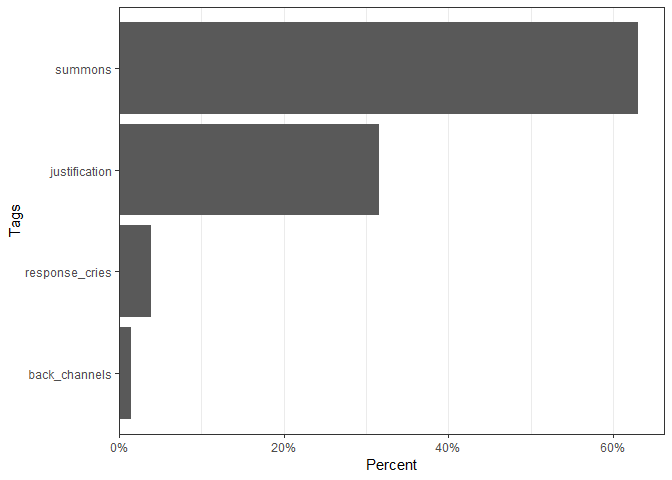

Improving the Model
-------------------

### Improving Coverage

The model does not have very good coverage. To improve this the
researcher will want to look at the data with no coverage to try to
build additional regular expressions and categories. This requires
understanding language, noticing additional features of the data with no
coverage that may map to categories, and building regular expressions to
model these features. This section will outline some of the tools that
can be used to detect features and build regular expressions to model
these language features.

We first want to view the untagged data. The `uncovered` function
provides a logical vector that can be used to extract the text with no
tags.

    untagged <- get_uncovered(model)

    head(untagged)

    ## [1] "We'll talk about specifically about health care in a moment."                                                                                                                                              
    ## [2] "What I support is no change for current retirees and near retirees to Medicare."                                                                                                                           
    ## [3] "And the president supports taking dollar seven hundred sixteen billion out of that program."                                                                                                               
    ## [4] "So that's that's number one."                                                                                                                                                                              
    ## [5] "Number two is for people coming along that are young, what I do to make sure that we can keep Medicare in place for them is to allow them either to choose the current Medicare program or a private plan."
    ## [6] "Their choice."

The `frequent_terms` function can be used again to understand common
features of the untagged data.

    untagged %>%
        frequent_terms()

    ##    term      frequency
    ## 1  going     211      
    ## 2  governor  177      
    ## 3  president 172      
    ## 4  people    169      
    ## 5  make      166      
    ## 6  said      149      
    ## 7  want      130      
    ## 8  sure      110      
    ## 9  just      107      
    ## 10 years     101      
    ## 11 jobs       96      
    ## 12 romney     95      
    ## 13 know       82      
    ## 14 four       81      
    ## 15 also       78      
    ## 16 america    77      
    ## 17 right      76      
    ## 18 well       74      
    ## 19 world      72      
    ## 20 think      66

We may see a common term such as the word *right* and want to see what
other terms collocate with it. Using a regular expression that searches
for multiple terms can improve a model's accuracy and ability to
discriminate. Using `search_term` in combination with `frequent_terms`
can be a powerful way to see which words tend to collocate. Here I pass
a regex for *right* (`\\bright`) to `search_term`. This pulls up the
text that contains this term. I then use `frequent_terms` to see what
words frequently occur with the word *right*. We notice the word
*people* tends to occur with *right*.

    untagged %>%
        search_term("\\bright") %>%
        frequent_terms(10, stopwords = "right")

    ##    term       frequency
    ## 1  that       32       
    ## 2  have       12       
    ## 3  people     10       
    ## 4  with        9       
    ## 5  this        8       
    ## 6  government  7       
    ## 7  course      6       
    ## 8  going       6       
    ## 9  it's        6       
    ## 10 president   6       
    ## 11 that's      6       
    ## 12 want        6       
    ## 13 you're      6

The `search_term_collocations` function provides a convenient wrapper
for `search_term` + `frequent_terms` which also removes the search term
from the output.

    untagged %>%
        search_term_collocations("\\bright", n=10)

    ##    term       frequency
    ## 1  people     10       
    ## 2  government  7       
    ## 3  course      6       
    ## 4  going       6       
    ## 5  president   6       
    ## 6  want        6       
    ## 7  also        5       
    ## 8  governor    5       
    ## 9  jobs        5       
    ## 10 make        5

This is an exploratory act. Finding the right combination of features
that occur together requires lots of recursive noticing, trialling,
testing, reading, interpreting, and deciding. After we noticed that the
terms *people* and *course* appear with the term *right* above we will
want to see these text elements. We can use a grouped-or expression with
`colo` to build a regular expression that will search for any text
elements that contain these two terms anywhere. `colo` is more powerful
than initially shown here; I demonstrate further functionality below.
Here is the regex produced.

    colo("\\bright", "(people|course)")

    ## [1] "((\\bright.*(people|course))|((people|course).*\\bright))"

This is extremely powerful when used inside of `search_term` as the text
containing this regular expression will be returned along with the
coverage proportion on the uncovered data.

    search_term(untagged, colo("\\bright", "(people|course)"))

    ##  [1] "Right now, the CBO says up to twenty million people will lose their insurance as Obamacare goes into effect next year."                                                                                                                                                                                                  
    ##  [2] "The federal government taking over health care for the entire nation and whisking aside the tenth Amendment, which gives states the rights for these kinds of things, is not the course for America to have a stronger, more vibrant economy."                                                                           
    ##  [3] "And what we're seeing right now is, in my view, a a trickle down government approach, which has government thinking it can do a better job than free people pursuing their drea Miss And it's not working."                                                                                                              
    ##  [4] "And the challenges America faces right now look, the reason I'm in this race is there are people that are really hurting today in this country."                                                                                                                                                                         
    ##  [5] "It's going to help people across the country that are unemployed right now."                                                                                                                                                                                                                                             
    ##  [6] "That's not the right course for America."                                                                                                                                                                                                                                                                                
    ##  [7] "The right course for America is to have a true all of the above policy."                                                                                                                                                                                                                                                 
    ##  [8] "When you've got thousands of people right now in Iowa, right now in Colorado, who are working, creating wind power with good paying manufacturing jobs, and the Republican senator in that in Iowa is all for it, providing tax breaks to help this work and Governor Romney says I'm opposed."                          
    ##  [9] "When it comes to community colleges, we are setting up programs, including with Nassau Community College, to retrain workers, including young people who may have dropped out of school but now are getting another chance, training them for the jobs that exist right now."                                            
    ## [10] "That's not the right course for us."                                                                                                                                                                                                                                                                                     
    ## [11] "The right course for us is to make sure that we go after the the people who are leaders of these various anti American groups and these these jihadists, but also help the Muslim world."                                                                                                                                
    ## [12] "And so the right course for us, is working through our partners and with our own resources, to identify responsible parties within Syria, organize them, bring them together in a in a form of if not government, a form of of of council that can take the lead in Syria."                                              
    ## [13] "And it's widely reported that drones are being used in drone strikes, and I support that and entirely, and feel the president was right to up the usage of that technology, and believe that we should continue to use it, to continue to go after the people that represent a threat to this nation and to our friends."
    ## [14] "People can look it up, you're right."                                                                                                                                                                                                                                                                                    
    ## [15] "Those are the kinds of choices that the American people face right now."                                                                                                                                                                                                                                                 
    ## attr(,"coverage")
    ## [1] 0.005921832

We notice right away that the phrase *right course* appears often. We
can create a search with just this expression.

***Note*** *that the decision to include a regular expression in the
model is up to the researcher. We must guard against over-fitting the
model, making it not transferable to new, similar contexts.*

    search_term(untagged, "right course")

    ## [1] "That's not the right course for America."                                                                                                                                                                                                                                  
    ## [2] "The right course for America is to have a true all of the above policy."                                                                                                                                                                                                   
    ## [3] "That's not the right course for us."                                                                                                                                                                                                                                       
    ## [4] "The right course for us is to make sure that we go after the the people who are leaders of these various anti American groups and these these jihadists, but also help the Muslim world."                                                                                  
    ## [5] "And so the right course for us, is working through our partners and with our own resources, to identify responsible parties within Syria, organize them, bring them together in a in a form of if not government, a form of of of council that can take the lead in Syria."
    ## attr(,"coverage")
    ## [1] 0.001973944

Based on the `frequent_terms` output above, the word *jobs* also seems
important. Again, we use the `search_term` + `frequent_terms` combo to
extract words collocating with *jobs*.

    search_term_collocations(untagged, "jobs", n=15)

    ##    term          frequency
    ## 1  million       17       
    ## 2  create        15       
    ## 3  going         15       
    ## 4  back          12       
    ## 5  country       11       
    ## 6  people        10       
    ## 7  make           9       
    ## 8  sure           9       
    ## 9  five           8       
    ## 10 hundred        8       
    ## 11 overseas       8       
    ## 12 want           8       
    ## 13 years          8       
    ## 14 businesses     7       
    ## 15 companies      7       
    ## 16 creating       7       
    ## 17 energy         7       
    ## 18 good           7       
    ## 19 just           7       
    ## 20 manufacturing  7       
    ## 21 thousand       7

As stated above, `colo` is a powerful search tool as it can take
multiple regular expressions as well as allowing for multiple negations
(i.e., find x but not if y). To include multiple negations use a
grouped-or regex as shown below.

    ## Where do `jobs` and `create` collocate?
    search_term(untagged, colo("jobs", "create")) 

    ##  [1] "If I'm president I will create help create twelve million new jobs in this country with rising incomes."                                                                                                                                                                     
    ##  [2] "I know what it takes to create good jobs again."                                                                                                                                                                                                                             
    ##  [3] "And what I want to do, is build on the five million jobs that we've created over the last thirty months in the private sector alone."                                                                                                                                        
    ##  [4] "It's going to help those families, and it's going to create incentives to start growing jobs again in this country."                                                                                                                                                         
    ##  [5] "We created twenty three million new jobs."                                                                                                                                                                                                                                   
    ##  [6] "two million new jobs created."                                                                                                                                                                                                                                               
    ##  [7] "We've created five million jobs, and gone from eight hundred jobs a month being lost, and we are making progress."                                                                                                                                                           
    ##  [8] "He keeps saying, Look, I've created five million jobs."                                                                                                                                                                                                                      
    ##  [9] "eight percent, between that period the end of that recession and the equivalent of time to today, Ronald Reagan's recovery created twice as many jobs as this president's recovery."                                                                                         
    ## [10] "This is the way we're going to create jobs in this country."                                                                                                                                                                                                                 
    ## [11] "We have to be competitive if we're going to create more jobs here."                                                                                                                                                                                                          
    ## [12] "We need to create jobs here."                                                                                                                                                                                                                                                
    ## [13] "And it's estimated that that will create eight hundred thousand new jobs."                                                                                                                                                                                                   
    ## [14] "That's not the way we're going to create jobs here."                                                                                                                                                                                                                         
    ## [15] "The way we're going to create jobs here is not just to change our tax code, but also to double our exports."                                                                                                                                                                 
    ## [16] "That's going to help to create jobs here."                                                                                                                                                                                                                                   
    ## [17] "Government does not create jobs."                                                                                                                                                                                                                                            
    ## [18] "Government does not create jobs."                                                                                                                                                                                                                                            
    ## [19] "Barry, I think a lot of this campaign, maybe over the last four years, has been devoted to this nation that I think government creates jobs, that that somehow is the answer."                                                                                               
    ## [20] "And when it comes to our economy here at home, I know what it takes to create twelve million new jobs and rising take home pay."                                                                                                                                             
    ## [21] "And Governor Romney wants to take us back to those policies, a foreign policy that's wrong and reckless, economic policies that won't create jobs, won't reduce our deficit, but will make sure that folks at the very top don't have to play by the same rules that you do."
    ## attr(,"coverage")
    ## [1] 0.008290565

    ## Where do `jobs`, `create`,  and the word `not` collocate?
    search_term(untagged, colo("jobs", "create", "(not|'nt)")) 

    ## [1] "That's not the way we're going to create jobs here."                                                        
    ## [2] "The way we're going to create jobs here is not just to change our tax code, but also to double our exports."
    ## [3] "Government does not create jobs."                                                                           
    ## [4] "Government does not create jobs."                                                                           
    ## attr(,"coverage")
    ## [1] 0.001579155

    ## Where do `jobs` and`create` collocate without a `not` word?
    search_term(untagged, colo("jobs", "create", not = "(not|'nt)")) 

    ##  [1] "If I'm president I will create help create twelve million new jobs in this country with rising incomes."                                                                                                                                                                     
    ##  [2] "I know what it takes to create good jobs again."                                                                                                                                                                                                                             
    ##  [3] "And what I want to do, is build on the five million jobs that we've created over the last thirty months in the private sector alone."                                                                                                                                        
    ##  [4] "It's going to help those families, and it's going to create incentives to start growing jobs again in this country."                                                                                                                                                         
    ##  [5] "We created twenty three million new jobs."                                                                                                                                                                                                                                   
    ##  [6] "two million new jobs created."                                                                                                                                                                                                                                               
    ##  [7] "We've created five million jobs, and gone from eight hundred jobs a month being lost, and we are making progress."                                                                                                                                                           
    ##  [8] "He keeps saying, Look, I've created five million jobs."                                                                                                                                                                                                                      
    ##  [9] "eight percent, between that period the end of that recession and the equivalent of time to today, Ronald Reagan's recovery created twice as many jobs as this president's recovery."                                                                                         
    ## [10] "This is the way we're going to create jobs in this country."                                                                                                                                                                                                                 
    ## [11] "We have to be competitive if we're going to create more jobs here."                                                                                                                                                                                                          
    ## [12] "We need to create jobs here."                                                                                                                                                                                                                                                
    ## [13] "And it's estimated that that will create eight hundred thousand new jobs."                                                                                                                                                                                                   
    ## [14] "That's going to help to create jobs here."                                                                                                                                                                                                                                   
    ## [15] "Barry, I think a lot of this campaign, maybe over the last four years, has been devoted to this nation that I think government creates jobs, that that somehow is the answer."                                                                                               
    ## [16] "And when it comes to our economy here at home, I know what it takes to create twelve million new jobs and rising take home pay."                                                                                                                                             
    ## [17] "And Governor Romney wants to take us back to those policies, a foreign policy that's wrong and reckless, economic policies that won't create jobs, won't reduce our deficit, but will make sure that folks at the very top don't have to play by the same rules that you do."
    ## attr(,"coverage")
    ## [1] 0.006711409

    ## Where do `jobs`, `romney`, and `create` collocate?
    search_term(untagged, colo("jobs", "create", "romney")) 

    ## [1] "And Governor Romney wants to take us back to those policies, a foreign policy that's wrong and reckless, economic policies that won't create jobs, won't reduce our deficit, but will make sure that folks at the very top don't have to play by the same rules that you do."
    ## attr(,"coverage")
    ## [1] 0.0003947888

Here is one more example with `colo` for the words *jobs* and
*overseas*. The user may want to quickly test and then transfer the
regex created by `colo` to the regular expression list. By setting
`options(termco.copy2clip = TRUE)` the user globally sets `colo` to use
the **clipr** package to copy the regex to the clipboard for better work
flow.

    search_term(untagged, colo("jobs", "overseas")) 

    ## [1] "And everything that I've tried to do, and everything that I'm now proposing for the next four years in terms of improving our education system or developing American energy or making sure that we're closing loopholes for companies that are shipping jobs overseas and focusing on small businesses and companies that are creating jobs here in the United States, or closing our deficit in a responsible, balanced way that allows us to invest in our future."
    ## [2] "You can ship jobs overseas and get tax breaks for it."                                                                                                                                                                                                                                                                                                                                                                                                                
    ## [3] "The outsourcing of American jobs overseas has taken a toll on our economy."                                                                                                                                                                                                                                                                                                                                                                                           
    ## [4] "Making sure that we're bringing manufacturing back to our shores so that we're creating jobs here, as we've done with the auto industry, not rewarding companies that are shipping jobs overseas."                                                                                                                                                                                                                                                                    
    ## [5] "I know Americans had seen jobs being shipped overseas; businesses and workers not getting a level playing field when it came to trade."                                                                                                                                                                                                                                                                                                                               
    ## [6] "Having a tax code that rewards companies that are shipping jobs overseas instead of companies that are investing here in the United States, that will not make us more competitive."                                                                                                                                                                                                                                                                                  
    ## [7] "And the one thing that I'm absolutely clear about is that after a decade in which we saw drift, jobs being shipped overseas, nobody championing American workers and American businesses, we've now begun to make some real progress."                                                                                                                                                                                                                                
    ## [8] "And I've put forward a plan to make sure that we're bringing manufacturing jobs back to our shores by rewarding companies and small businesses that are investing here, not overseas."                                                                                                                                                                                                                                                                                
    ## attr(,"coverage")
    ## [1] 0.00315831

The researcher uses an iterative process to continue to build the
regular expression list. The `term_count` function builds the matrix of
counts to further test the model. The use of (a) `coverage`, (b)
`as_terms` + `plot_counts`, and (c) `as_terms` + `freq_counts` will
allow for continued testing of model functioning.

### Improving Discrimination

It is often desirable to improve discrimination. While the bar plot
highlighting the distribution of the number of tags is useful, it only
indicates if there is a problem, not where the problem lies. The
`tag_co_occurrence` function produces a list of `data.frame` and
`matrices` that aide in understanding how to improve discrimination.
This list is useful, but the `plot` method provides an improved visual
view of the co-occurrences of tags.

The network plot on the left shows the strength of relationships between
tags, while the plot on the right shows the average number of other tags
that co-occur with each regex tag. In this particular case the plot
combo is not complex because of the limited number of regex tags. Note
that the edge strength is relative to all other edges. The strength has
to be considered in the context of the average number of other tags that
co-occur with each regex tag bar/dot plot on the right. As the number of
tags increases the plot increases in complexity. The unconnected nodes
and shorter bars represent the tags that provide the best discriminatory
power, whereas the other tags have the potential to be redundant.

    tag_co_occurrence(model) %>%
        plot(min.edge.cutoff = .01)

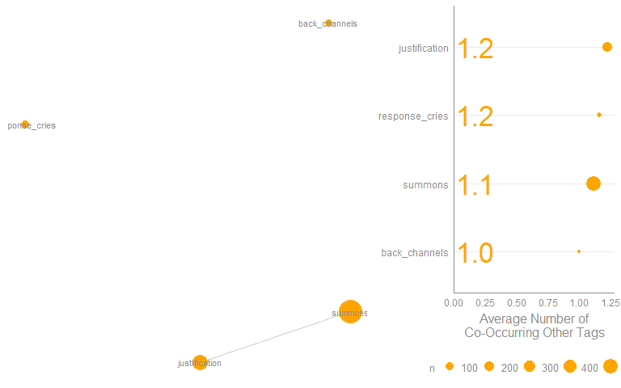

Another way to view the overlapping complexity and relationships between
tags is to use an [Upset plot](http://caleydo.org/tools/upset/). The
`plot_upset` function wraps `UpSetR::upset` and is made to handle
`term_count` objects directly. Upset plots are complex and require study
of the method in order to interpret the results
(<http://caleydo.org/tools/upset>). The time invested in learning this
plot type can be very fruitful in utilizing a technique that scales to
the types of data sets that **termco** outputs. This tool can be useful
in order to understand overlap and thus improve discrimination.

    plot_upset(model) 

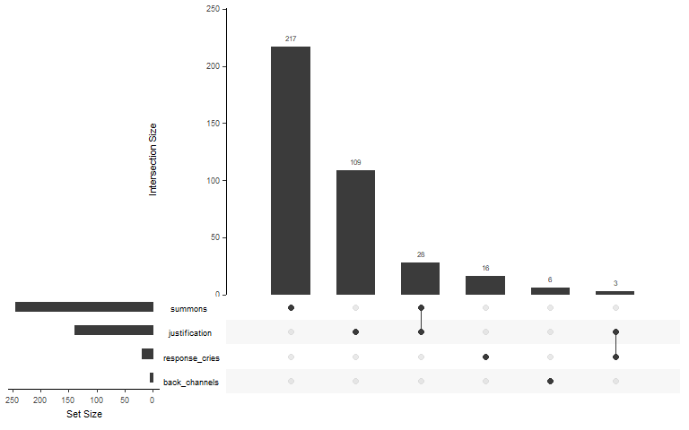

Categorizing/Tagging
--------------------

The `classify` function enables the researcher to apply *n* tags to each
text element. Depending on the text and the regular expression list's
ability, multiple tags may be applied to a text. The `n` argument allows
the maximum number of tags to be set though the function does not
guarantee this many (or any) tags will be assigned.

Here I show the `head` of the returned vector (if `n` &gt; 1 a `list`
may be returned) as well as a `table` and plot of the counts. Use
`n = Inf` to return all tags.

    classify(model) %>%
        head()

    ## [1] NA               "response_cries" NA               NA              
    ## [5] "response_cries" NA

    classify(model) %>%
        unlist() %>%
        table()

    ## .
    ##  back_channels  justification response_cries        summons 
    ##              6            125             17            231

    classify(model) %>%
        unlist() %>%
        plot_counts() + xlab("Tags")

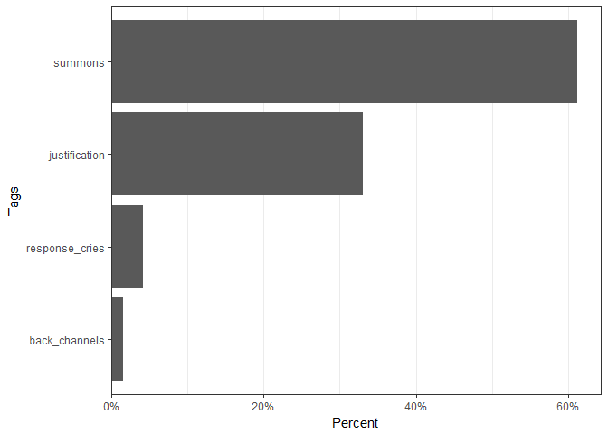

Evaluation: Accuracy
--------------------

### Pre Coded Data

The `evaluate` function is a more formal method of evaluation than
`validate_model`. The `evaluate` function yields a test a model's
accuracy, precision, and recall using macro and micro averages of the
confusion matrices for each tag as outlined by [Dan Jurafsky & Chris
Manning](https://www.youtube.com/watch?v=OwwdYHWRB5E&index=31&list=PL6397E4B26D00A269).
The function requires a known, human coded sample. In the example below
I randomly generate "known human coded tagged" vector. Obviously, this
is for demonstration purposes. The model outputs a pretty printing of a
list. Note that if a larger, known tagging set of data is available the
user may want to strongly consider machine learning models (see:
[**RTextTools**](https://cran.r-project.org/package=RTextTools)).

This minimal example will provide insight into the way the evaluate
scores behave:

    known <- list(1:3, 3, NA, 4:5, 2:4, 5, integer(0))
    tagged <- list(1:3, 3, 4, 5:4, c(2, 4:3), 5, integer(0))
    evaluate(tagged, known)

    ## ----------------------------------------------- 
    ## Tag Level Measures
    ## ----------------------------------------------- 
    ##           tag precision recall F_score accuracy
    ##             1     1.000  1.000   1.000    1.000
    ##             2     1.000  1.000   1.000    1.000
    ##             3     1.000  1.000   1.000    1.000
    ##             4      .667  1.000    .800     .857
    ##             5     1.000  1.000   1.000    1.000
    ## No_Code_Given      .000   .000    .000     .857
    ## 
    ## -------------------- 
    ## Summary Measures
    ## -------------------- 
    ## N:                 7
    ## 
    ## Macro-Averaged  
    ##   Accuracy:     .952
    ##   F-score:      .800
    ##   Precision:    .778
    ##   Recall:       .833
    ## 
    ## Micro-Averaged  
    ##   Accuracy:     .952
    ##   F-score:      .909
    ##   Precision:    .909
    ##   Recall:       .909

Below we create fake "known" tags to test `evaluate` with real data
(though the comparison is fabricated).

    mod1 <- presidential_debates_2012 %>%
        with(term_count(dialogue, TRUE, discoure_markers)) %>%
        classify()

    fake_known <- mod1
    set.seed(1)
    fake_known[sample(1:length(fake_known), 300)] <- "random noise"

    evaluate(mod1, fake_known)

    ## ------------------------------------------------ 
    ## Tag Level Measures
    ## ------------------------------------------------ 
    ##            tag precision recall F_score accuracy
    ##  back_channels     1.000  1.000   1.000    1.000
    ##  justification      .902  1.000    .949     .996
    ##  No_Code_Given      .896  1.000    .945     .909
    ##   random noise      .000   .000    .000     .897
    ## response_cries      .812  1.000    .897     .999
    ##        summons      .910  1.000    .953     .993
    ## 
    ## -------------------- 
    ## Summary Measures
    ## -------------------- 
    ## N:             2,912
    ## 
    ## Macro-Averaged  
    ##   Accuracy:     .966
    ##   F-score:      .791
    ##   Precision:    .753
    ##   Recall:       .833
    ## 
    ## Micro-Averaged  
    ##   Accuracy:     .966
    ##   F-score:      .897
    ##   Precision:    .897
    ##   Recall:       .897

### Post Coding Data

It is often useful to less formally, validate a model via human
evaluation; checking that text is being tagged as expected. This
approach is more formative and less rigorous than `evaluate`, intended
to be used to assess model functioning in order to improve it. The
`validate_model` provides an interactive interface for a single
evaluator to sample n tags and corresponding texts and assess the
accuracy of the tag to the text. The `assign_validation_task` generates
an external file(s) for n coders for redundancy of code assessments.
This may be of use in [Mechanical
Turk](https://www.mturk.com/mturk/welcome) type applications. The
example below demonstrates `validate_model`'s `print`/`summary` and
`plot` outputs.

    validated <- model %>%
        validate_model()

After `validate_model` has been run the `print`/`summary` and `plot`
provides an accuracy of each tag and a confidence level (note that the
confidence band is highly affected by the number of samples per tag).

    validated

    ## -------
    ## Overall:
    ## -------
    ##    accuracy n.tagged n.classified sampled  se lower upper
    ## 1:    59.6%      484          328      57 .06 46.9% 72.4%
    ## 
    ## 
    ## ---------------
    ## Individual Tags:
    ## ---------------
    ##               tag accuracy n.tagged n.classified sampled  se lower  upper
    ## 1:  back_channels    83.3%        7            6       6 .15 53.5% 100.0%
    ## 2: response_cries    72.7%       13           11      11 .13 46.4%  99.0%
    ## 3:  justification    55.0%      155          122      20 .11 33.2%  76.8%
    ## 4:        summons    50.0%      309          189      20 .11 28.1%  71.9%

    plot(validated)

These examples give guidance on how to use the tools in the **termco**
package to build an expert rules, regular expression text classification
model.